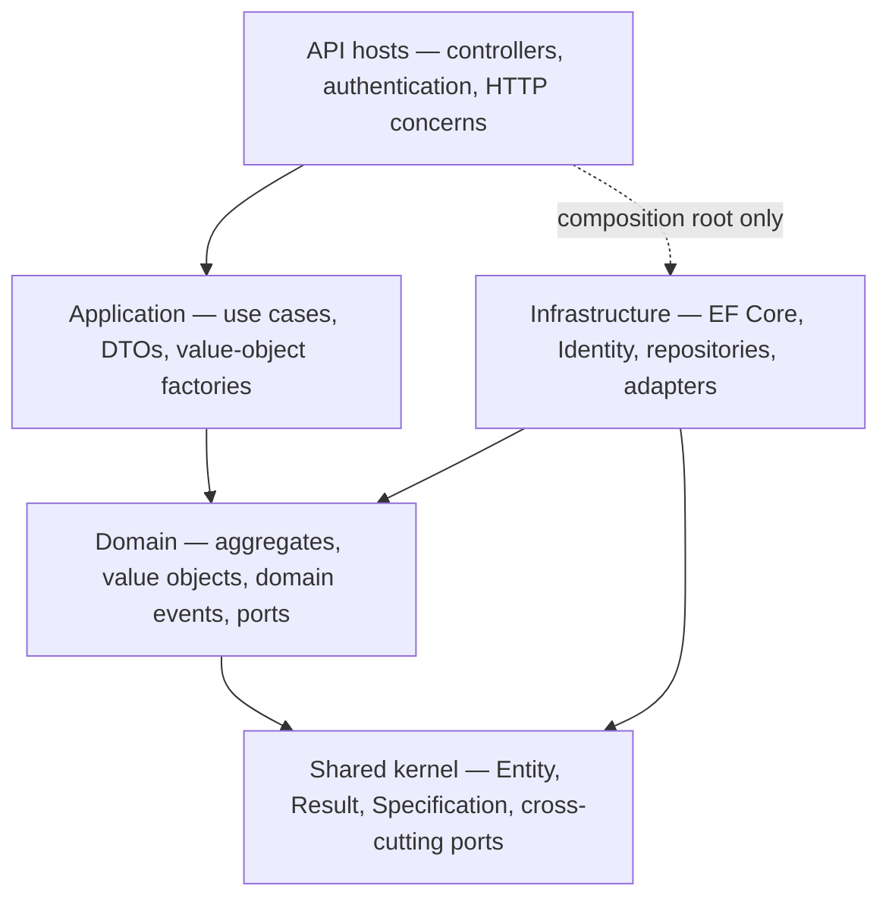
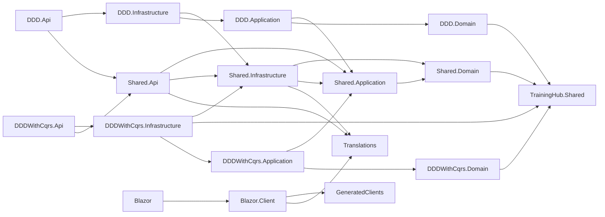
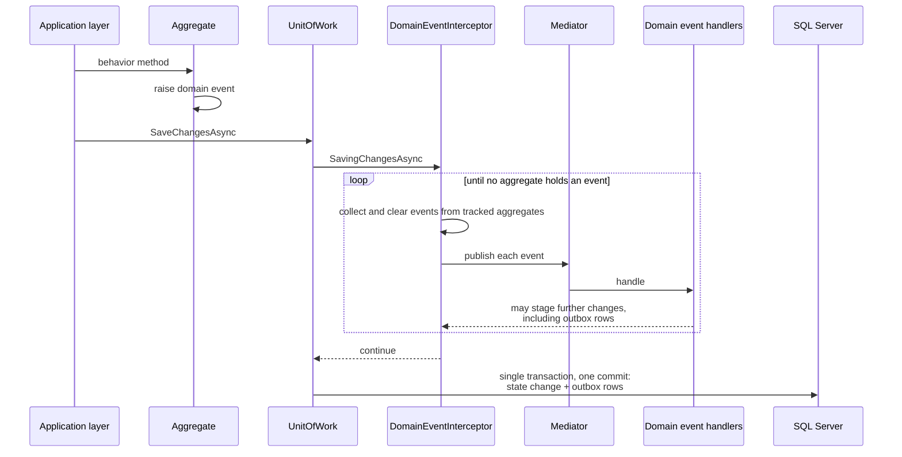
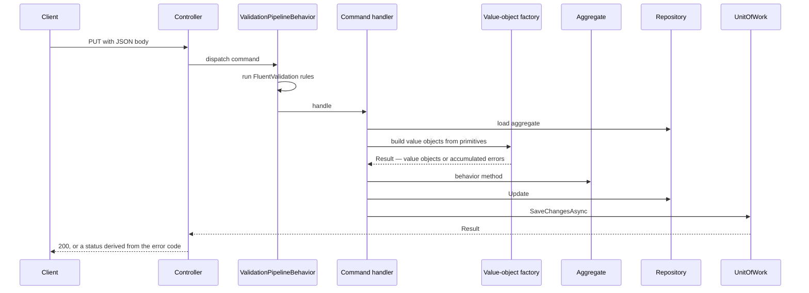
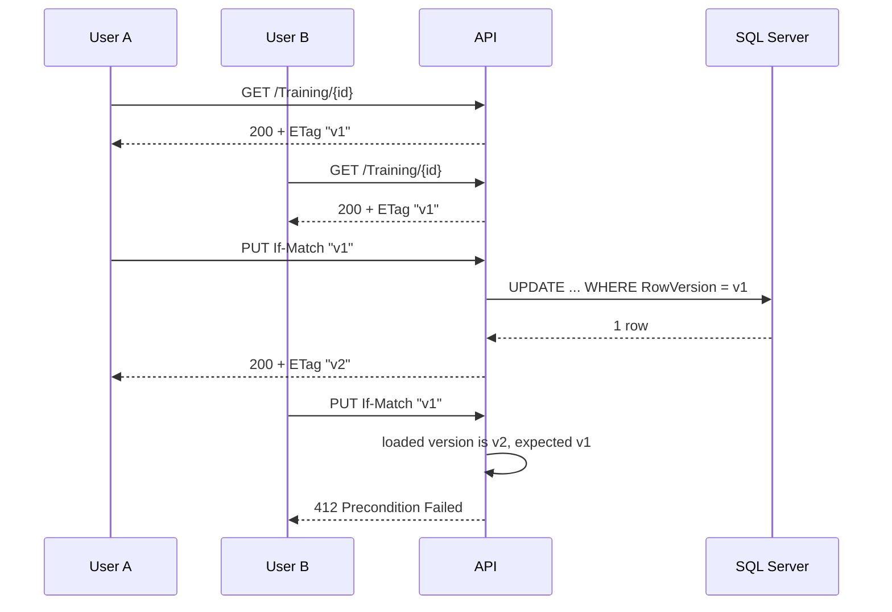

# TrainingHub

[](https://github.com/maxime-poulain/TrainingHub/actions/workflows/ci.yml)
[](https://sonarcloud.io/summary/new_code?id=maxime-poulain_BLRefactoring)
[](https://sonarcloud.io/component_measures?id=maxime-poulain_BLRefactoring&metric=coverage)

A .NET 10 reference implementation that runs **two application styles over one shared domain
model**: a classic layered DDD stack and a CQRS stack. Both expose the same trainer/training
business capabilities, persist through the same EF Core model against SQL Server, and react to
the same domain events — so the two styles can be compared on identical ground rather than on
two different problems.

---

## Table of contents

- [What this project is](#what-this-project-is)
- [Strategic design](#strategic-design)
- [Architecture](#architecture)
- [Domain model](#domain-model)
- [How it works](#how-it-works)
- [Persistence](#persistence)
- [Security](#security)
- [API reference](#api-reference)
- [Observability](#observability)
- [Tech stack](#tech-stack)
- [Getting started](#getting-started)
- [Testing](#testing)
- [Continuous integration](#continuous-integration)
- [Repository conventions](#repository-conventions)
- [License](#license)

---

## What this project is

The domain is deliberately small — trainers publish trainings — so that the architecture stays
the subject. What the repository actually demonstrates:

- **One domain, two application styles.** `TrainingHub.Shared.Domain` is consumed unchanged by
  an application-service stack (`src/DDD`) and a command/query stack (`src/DDDWithCqrs`). Every
  use case exists in both, which makes the trade-offs of each style directly observable.
- **A domain that speaks only in business concepts.** Aggregates accept value objects and typed
  identifiers — never a `string`, a `Guid` or a parameter object shaped like an HTTP request.
  Turning raw input into those concepts is the application layer's job.
- **Invariants that cannot be bypassed.** Constructors are private, collections are exposed
  read-only, and every state transition goes through a behavior method that either succeeds
  entirely or changes nothing.
- **Failure as a value, not an exception.** A railway-oriented `Result` carries accumulated
  business errors from the domain up to the HTTP status code.
- **Domain events dispatched inside the unit of work**, before persistence, so a handler's own
  writes join the same transaction.
- **End-to-end optimistic concurrency**, from a SQL Server `rowversion` up to HTTP `ETag` /
  `If-Match`, so two users cannot silently overwrite each other.

---

## Strategic design

Everything below this line is the tactical half of Domain-Driven Design — what the model is made of.
The strategic half is what decides where the lines are, and it lives in
**[`docs/strategic-design/`](docs/strategic-design/)**: the bounded contexts and their ubiquitous
language, a context map that names where each seam is visible in the code, and an event storming of
the two main flows.

Start there if you want the business before the architecture. Six architecture rules keep those
documents answerable to the model — an aggregate nobody placed in a context fails the build, and so
does a term the document and the code spell differently. See
[ADR 0023](docs/adr/0023-document-the-strategic-design-and-hold-it-to-the-model.md); what those
documents *list* is derived from the code as well, by
[ADR 0041](docs/adr/0041-derive-every-named-list-from-the-code.md).

---

## Architecture

### The dependency rule

Dependencies point inward. The domain knows nothing of persistence, HTTP or the shape of the
messages the API receives; infrastructure depends on the domain to implement its ports.



`TrainingHub.Shared.Domain` references exactly one project — the shared kernel — and nothing
else.

The two API hosts are thin. What they have in common — controller bases, the `TrainingOwner`
policy, CORS, Identity and JWT wiring, the logging pipeline, the HTTP side of optimistic
concurrency — lives in `TrainingHub.Shared.Api`, so a rule can only be written once. Duplicating it across two
`Program.cs` is how the CQRS host ended up with no CORS policy at all while the layered one had
one, and how it kept relying on an `IHttpContextAccessor` it never registered. Persistence stayed
in `TrainingHub.Shared.Infrastructure`, which carries no ASP.NET Core framework reference.

**HTTP is a boundary, not a window.** The contracts the API publishes — `*HttpRequest` and
`*HttpResponse`, under `Shared.Api/Contracts/` — belong to the API and to nothing else. Commands,
queries and application DTOs stop at that line: no controller names one, and each host maps the
shared contracts onto its own vocabulary — the layered one to its application services, the CQRS
one to its commands and queries. Before that, the CQRS controllers bound an `EditTrainingCommand`
straight from the request body and then assigned its route identifier and expected version onto
it, which is why those commands carried `[JsonIgnore]`: a serialization concern lodged inside an
application message. The published API and the internals can now change without each other's
permission, and the two hosts cannot drift on it, since the contract they serve is one object.

**A list leaves as one page, on either host.** `PageRequest` and `PagedResult<T>` are kernel
vocabulary beside `Result`, and both hosts answer their list endpoint with the same envelope and
its metadata. It was not always so: for a while only the CQRS host paged, deliberately — until the
asymmetry falsified two of this repository's own promises, that the stacks are compared on
identical ground and that the client generated from either host fits both. What the parity shows
instead is the honest difference: the layered service asks the repository a named question
(`GetPageByTrainerIdAsync`) and gets a page of whole aggregates to map, while the CQRS handler
projects only the columns its DTO names before the page is fetched. Same contract on the wire,
different bill underneath.

Pages also need an order no two rows can tie on, or `OFFSET`/`FETCH` lets the server put a row on
two pages and another on none. `ToPagedResultAsync` therefore takes an `IOrderedQueryable`, which
only `NewestFirst` produces, so nobody can page without ordering first — the mistake is
unwritable rather than discouraged. The order, the bounds and the envelope are recorded in
[ADR 0001](docs/adr/0001-paginate-on-the-query-side-over-a-total-order.md); the parity, and what
it displaced, in [ADR 0029](docs/adr/0029-answer-a-list-the-same-way-on-both-hosts.md).

The request contracts declare their constraints as **data annotations**, so `[ApiController]`
rejects a malformed body at model binding with a `ValidationProblemDetails` keyed by field name,
before any command or application service sees it. The shape matters as much as the check: a form
on the other end can mark each offending input rather than show one message for the whole
submission, and the annotations reach the OpenAPI document, so generated clients inherit the same
constraints. They mirror the bounds the value objects enforce — the domain stays the judge and
rejects on its own terms anything that reaches it another way. What they deliberately do not
check is the shape of an email address: .NET's `[EmailAddress]` and the domain's validator
disagree, and an API refusing what the domain accepts would be worse than one asking later.

**Every failure leaves in the same shape**, an RFC 7807 `ProblemDetails`, whether it came from a
data annotation, a FluentValidation rule, a business rule or an unhandled exception — with the
domain error codes carried in the `domainErrors` extension, so a client can still branch on
`Training.DuplicateTitle`. The API used to answer four different bodies depending on how far a request got,
one of them a bare JSON string. The handlers live in `Shared.Api`, so the two hosts cannot differ on
them — the layered one had none at all. See
[ADR 0004](docs/adr/0004-publish-every-error-as-rfc-7807-problem-details.md).

### Solution layout

Twenty-eight projects: seventeen under `src/`, eleven under `tests/`. Every one of them targets
**net10.0** ([ADR 0076](docs/adr/0076-target-one-framework-across-the-solution.md)).

| Project | Responsibility |
|---|---|
| `TrainingHub.Shared` | Shared kernel: `Entity`, `AggregateRoot`, `ValueObject`, `EntityId`, `Result`/`ErrorCollection`, `Specification`, `PageRequest`/`PagedResult`, and the cross-cutting ports `IUnitOfWork` and `ICurrentUserService`, plus the CQS marker interfaces |
| `TrainingHub.Shared.Domain` | The domain model: `Trainer` and `Training` aggregates, value objects, domain events, specifications, repository interfaces, and the fact ports `IUniquenessTitleChecker`, `ITrainingCounter`, `ITrainerStanding`, `ITrainerVerification` and `ITrainerPhotoStore` |
| `TrainingHub.Shared.Application` | Value-object factories, DTOs, the aggregate-to-DTO projections, the search ports, the eighteen domain event handlers, the integration events with their stable-name registry and both ports (publisher and consumer), and the twenty post-commit consumers — all shared by both stacks |
| `TrainingHub.Shared.Infrastructure` | Persistence only: EF Core `TrainingContext`, mappings, migrations, interceptors, `UnitOfWork`, repositories, the paged-read extensions (`NewestFirst`, `ToPagedResultAsync`), the identity store, and the transactional outbox — publisher, delivery worker, dispatcher |
| `TrainingHub.Shared.Api` | The HTTP boundary: the `*HttpRequest` and `*HttpResponse` contracts both hosts publish, their mappings to the application layer, the controller bases, the `TrainingOwner` policy, CORS, Identity, JWT wiring, token issuance, concurrency helpers |
| `DDD.Application` | Application services: `TrainerApplicationService`, `TrainingApplicationService`, `CatalogApplicationService`, `OutboxApplicationService` |
| `DDD.Api` | REST host for the layered stack — controllers, composition root |
| `DDDWithCqrs.Application` | Commands, command handlers, FluentValidation validators |
| `DDDWithCqrs.Infrastructure` | **Query handlers**, Mediator dispatchers, pipeline behaviors |
| `DDDWithCqrs.Api` | REST host for the CQRS stack — controllers, composition root |
| `DDD.Domain`, `DDD.Infrastructure`, `DDDWithCqrs.Domain` | Routing projects with no source files; the domain and infrastructure they stand for live in the `TrainingHub.Shared.*` projects |
| `TrainingHub.GeneratedClients` | NSwag-generated typed HTTP clients, checked in as source |
| `TrainingHub.Translations` | The words: marker types and the `.resx` families beside them — neutral English plus `fr` and `ru`, one satellite assembly per language — and the supported-language list every surface shares. References nothing, so every surface may load it ([ADR 0088](docs/adr/0088-answer-in-the-visitors-language-and-resolve-it-at-the-door.md)) |
| `TrainingHub.Blazor` / `.Client` | Blazor WebAssembly front end built with MudBlazor, and the **backend for frontend** that serves it: cookie authentication, and a YARP proxy that attaches the API's access token server-side |
| `tests/*` | Eleven projects — ten test suites and the shared kit they draw from — see [Testing](#testing) |

### Project dependency graph



The Blazor pair and the generated client form their own branch, reached by no backend project;
the backend graph is rooted at the shared kernel. The translations are the one assembly both
branches reach — the browser for its labels, the shared API layer for the supported-language
list, the shared infrastructure for the words its email presenter composes
([ADR 0090](docs/adr/0090-prove-the-address-before-the-catalog-grows.md)) — and they reference
nothing at all ([ADR 0088](docs/adr/0088-answer-in-the-visitors-language-and-resolve-it-at-the-door.md)).

---

## Domain model

### Trainer

```csharp
public static Trainer Create(TrainerId id, UserId userId, Name name, Email contactEmail, Bio? bio);
public void Edit(Name name, Email contactEmail, Bio? bio);
public void AttachPhoto(TrainerPhoto photo);
public void RemovePhoto();
public void MarkForDeletion();
```

`Create` returns a `Trainer`, **not** a `Result<Trainer>`: every argument is an already-valid
value object and the aggregate carries no cross-field rule, so assembling valid parts cannot
produce an invalid whole. `Edit` returns nothing for the same reason — a half-edited trainer is
impossible by construction rather than by discipline.

The profile is edited as a whole, from a single form carrying every field, so there is one entry
point rather than one mutator per attribute. Events are computed **before** mutation and raised
**only for attributes that actually changed**, using the value objects' structural equality. A
`null` bio clears it.

`ContactEmail` is the address a trainer publishes — deliberately distinct from the credential of
their Identity account, which the aggregate only ever references through `UserId`. Two trainers
of the same organization may share one, so no uniqueness rule applies to it.

`Photo` holds an identity, a media type and a size — never a bucket, a key or a URL. The aggregate
says *which* photo a trainer has; where the bytes live is the infrastructure's business, which is
why moving them to a different store touches no file in the domain. `TrainerPhoto.Create` mints a
fresh identity every time, and that is load-bearing rather than incidental: a replacement therefore
writes to a key nothing names yet, so the row can be committed before anything is deleted. Neither
`AttachPhoto` nor `RemovePhoto` hands the displaced photo back — an aggregate answers whether a
change was allowed and is not a way of reading through it — so a caller that has cleanup to do
reads `Photo` before the call. See ADR 0021.

### Training

```csharp
public static Task<Result<Training>> CreateAsync(
    TrainingId trainingId, TrainerId trainerId,
    TrainingTitle title, TrainingDescription description,
    TrainingPrerequisites prerequisites, AcquiredSkills acquiredSkills,
    IReadOnlyCollection<Topic> topics,
    IUniquenessTitleChecker titleChecker, ITrainingCounter trainingCounter,
    ITrainerStanding trainerStanding,
    CancellationToken cancellationToken = default);

public Task<Result> EditAsync(/* the same, with the title checker as its only port */);
```

Here the result **is** a `Result`, for the rules the aggregate cannot settle on its own — each
one a fact in rows it cannot see, brought to the factory through a port named after its question
(ADR 0030). A title must be unique among the trainings of the same trainer, asked through
`IUniquenessTitleChecker`; a trainer publishes at most `Training.MaximumPerTrainer` (ten)
trainings, asked through `ITrainingCounter` at creation and publication — editing changes a
training, never how many there are — answering `Training.CatalogFull` when the catalog is full;
and a suspended trainer may not grow their public footprint, asked through `ITrainerStanding`
and answering `Training.TrainerSuspended` (ADR 0053). Creation and
edition share a private `ApplyEditionAsync` that checks the title rule first and **mutates
nothing when it fails** — so a rejected edition never leaves the aggregate half-changed. The
uniqueness lookup only runs when the title actually changed. Topics are de-duplicated and fully
replaced on each edition.

Neither creation nor edition raises its event from that shared path: each public entry point
raises the event matching its own intent, and only on success.

`IsOwnedBy` is the one question the aggregate answers, and the exception that proves the
no-reading-through-aggregates rule rather than eroding it: it wears
`TrainingOwnedBySpecification` — a named domain rule, not a state read — and the rule that bans
data-returning methods pins it by name, so the next question has to arrive with a record of its
own. See ADR 0028.

Both aggregates carry a lifecycle
([ADR 0050](docs/adr/0050-retire-a-training-rather-than-delete-it.md)). A training is `Published`,
`Unpublished` or — by the administration's hand, with the reason written beside the state —
`Withheld` ([ADR 0052](docs/adr/0052-make-an-administrative-removal-a-state-of-its-own.md)); a
trainer is `Active` or `Suspended`; and public visibility is composed from trainer and training
rather than stored — so suspending a trainer writes one column and touches none of their
trainings, which is what makes the sanction liftable. Every move announces itself, which is what
separates this from a soft delete wearing an enum; a rule holds that part. The owner's pair runs
in both directions, while `Withheld` is one-way for its owner — only the administration releases
what it withheld. Deleting survives and changes role: withdrawing is the everyday act, and
`DELETE` answers the training created by mistake and a trainer's right to have their data removed.

### Value objects

Every value object has a private constructor and a static `Create` returning `Result<T>`, so an
invalid instance cannot exist. The three closed enumerations are the exception the rule states as a
shape: their only instances are their own static fields, so there is no factory because there is
nothing to refuse.

| Value object | Rule | Error code |
|---|---|---|
| `Name` | Firstname and lastname 2–50 characters once trimmed; **both errors accumulate** | `InvalidFirstname`, `InvalidLastname` |
| `Email` | Non-empty, valid format via `EmailValidation` | `InvalidEmail` |
| `Bio` | Non-empty, at most 500 characters once trimmed | `BioEmpty`, `BioExceeds500Characters` |
| `TrainingTitle` | Non-empty, 5–100 characters once trimmed | `InvalidTitle` |
| `TrainingDescription` | Non-empty, at most 500 characters | `InvalidDescription` |
| `TrainingPrerequisites` | Non-empty, at most 500 characters | `InvalidPrerequisites` |
| `AcquiredSkills` | Non-empty, at most 500 characters | `InvalidAcquiredSkills` |
| `Topic` | Closed set of sixteen values, resolved by name | `InvalidTopic` |
| `TrainingStatus` | Closed set of three: `Published`, `Unpublished`, `Withheld` | — |
| `TrainerStatus` | Closed set of two: `Active`, `Suspended` | — |
| `TrainerPhoto` | Non-empty, at most 5 MiB, PNG/JPEG/WebP — and the bytes must be what the content type declares | `PhotoEmpty`, `PhotoTooLarge`, `PhotoFormatNotSupported`, `PhotoContentMismatch` |

Three behaviors are worth knowing:

- **`TrainingTitle` compares case-insensitively.** `"Intro to C#"` and `"INTRO TO C#"` are the
  same title, which is what makes the uniqueness rule meaningful.
- **`Topic` is a closed enumeration**, not free text: Programming, Design, Marketing, Business,
  Personal Development, Leadership, Software Architecture, Cloud Computing, DevOps, Databases,
  Security, Web Development, Data and Analytics, Testing and Quality, Project Management, Agile
  Practices. Every one of them is a *subject* rather than a product — Cloud Computing rather than
  Azure, Databases rather than PostgreSQL — because a closed set that admits a product has to admit
  the next one (ADR 0079). `Topic.TryFromName` resolves a name without throwing — an unrecognized
  name is a validation error produced by the application layer, never an exception.
- **The two statuses resolve by name and throw**, unlike `Topic`, and the asymmetry is the point:
  a topic name arrives from a client and is reported back with everything else that was wrong,
  while a status name arrives from the column the domain wrote it to. A word the domain does not
  know there means a corrupt row, which no caller can be asked to handle and none should silently
  read as `Published`.

### Typed identifiers

`TrainerId`, `TrainingId` and `UserId` derive from `EntityId<T>`. Their constructors are private,
`Guid.Empty` is rejected at construction, and instances are built through `Create`, `Generate` or
an explicit cast — `TrainerId id = (TrainerId)someGuid` — all three backed by a compiled expression
cached per type. The cast is explicit, never implicit: turning a loose `Guid` into an identifier can
fail, and an implicit conversion would hide both the intent and the failure. Identifiers are generated by the caller before
the write, so the primary key is known without a database round-trip. A `TrainerId` is never
equal to a `TrainingId`, even for the same underlying `Guid`.

### Domain events

Events carry value objects and typed identifiers, not primitives.

| Event | Payload | Raised when |
|---|---|---|
| `TrainerCreatedDomainEvent` | `TrainerId`, `Name`, `Email` | A trainer is created |
| `TrainerNameChangedDomainEvent` | `TrainerId`, old `Name`, new `Name` | Only if the name actually changed |
| `TrainerContactEmailChangedDomainEvent` | `TrainerId`, old `Email`, new `Email` | Only if the contact email actually changed |
| `TrainerDeletedDomainEvent` | `TrainerId`, `PhotoId?` | A trainer is marked for deletion — the account erasing itself (ADR 0085). The photo's identity rides along because the post-commit collector runs after the rows are gone |
| `TrainingCreatedDomainEvent` | `TrainingId`, `TrainerId` | A training is successfully created |
| `TrainingEditedDomainEvent` | `TrainingId`, `TrainerId` | A training is successfully edited |
| `TrainingTransferredDomainEvent` | `TrainingId`, former `TrainerId`, new `TrainerId` | A training changes hands — decided by the one recorded domain service (ADR 0036) |

Events carry the facts their consumers need rather than just an identifier, because they are
dispatched **before** persistence: a handler cannot reload an aggregate that is not saved yet.

Their handlers live in `TrainingHub.Shared.Application/EventHandlers/` and are shared by both
stacks. Each is named `{Reaction}When{Event}Handler` with the event's full type name embedded —
so the `DomainEventHandler` suffix below is not decoration but the event's own name showing
through, the same way every post-commit consumer ends in `IntegrationEventHandler`
([ADR 0087](docs/adr/0087-name-a-handler-for-the-event-it-handles.md),
`EveryHandler_IsNamedForTheEventItHandles`):

| Handler | Reacts to | Effect |
|---|---|---|
| `PublishIntegrationEventWhenTrainerCreatedDomainEventHandler` | `TrainerCreatedDomainEvent` | Commits `TrainerCreatedIntegrationEvent` to the outbox — the welcome email becomes the delivery worker's reaction |
| `PublishIntegrationEventWhenTrainerContactEmailChangedDomainEventHandler` | `TrainerContactEmailChangedDomainEvent` | Commits both addresses as `TrainerContactEmailChangedIntegrationEvent` — warning the **previous** address becomes the worker's reaction |
| `AuditWhenTrainerNameChangedDomainEventHandler` | `TrainerNameChangedDomainEvent` | Structured audit trail |
| `DeleteTrainingWhenTrainerDeletedDomainEventHandler` | `TrainerDeletedDomainEvent` | Deletes the trainer's trainings — cross-aggregate consistency without a database cascade |
| `PublishIntegrationEventWhenTrainerDeletedDomainEventHandler` | `TrainerDeletedDomainEvent` | Commits `TrainerDeletedIntegrationEvent`, the photo's identity on it — collecting the portrait's bytes becomes the worker's reaction (ADR 0085) |
| `PublishIntegrationEventWhenTrainingCreatedDomainEventHandler` | `TrainingCreatedDomainEvent` | Commits `TrainingCreatedIntegrationEvent` to the outbox — indexing becomes the worker's reaction |
| `PublishIntegrationEventWhenTrainingEditedDomainEventHandler` | `TrainingEditedDomainEvent` | Commits `TrainingEditedIntegrationEvent`, kept apart from the created fact so consumers can tell them apart |
| `PublishIntegrationEventWhenTrainingTransferredDomainEventHandler` | `TrainingTransferredDomainEvent` | Commits `TrainingTransferredIntegrationEvent`, both owners on it — re-indexing under the new owner becomes the worker's reaction |

`Trainer.MarkForDeletion` is reached by the account erasing itself, and by nothing else: the
administration holds no such door, deliberately (see [Security](#security)). What the aggregate
states is the rule — a trainer does not disappear without their trainings — and the rule holds
whoever triggers it; erasure is its one caller ([ADR 0085](docs/adr/0085-let-the-account-erase-itself-trainings-and-all.md)).
The cascade's behavior is covered by `DomainEventPipelineTests`, which drives it through the
host's own services, and the whole erasure by `AccountErasureTests` on both hosts.

Six of the eighteen handlers act inside the transaction — ADR 0002's *domain reactions* — and twelve
translate the domain event into an integration event and commit it to the transactional outbox
(see [ADR 0024](docs/adr/0024-publish-facts-not-intents-and-version-them-in-the-envelope.md) and
[the outbox section](#domain-events-and-the-unit-of-work)). After the commit, the outbox delivery
worker hands each fact to its consumers — `IIntegrationEventHandler<TEvent>` implementations in
the same application layer — which is where the welcome email, the address warning, the three
sanction notices and the index updates now happen (ADR 0025, ADR 0056). The messages leave over
real SMTP: `IEmailSender` is declared beside its consumers in
`Shared.Application/Notifications/` and implemented by a MailKit adapter
pointed at whatever relay the `Smtp` section names — a Mailpit container locally (see
[ADR 0031](docs/adr/0031-send-email-over-smtp-and-prove-it-against-a-real-server.md)). Beside it
sits `INotificationComposer`, the presenter half: a consumer hands over facts and receives finished
prose in the recipient's own language, never in the language of whoever caused the notice — the
account states that language at registration, and each consumer reads it wherever it reads the
address ([ADR 0091](docs/adr/0091-write-to-everyone-in-the-language-they-read.md)).
`ITrainingSearchIndexer` is no longer a fake either. It moved out of the kernel to
`Shared.Application/Search/`, beside the query half the same record opened, and behind it sits a
real inverted index in two tables of this database: one entry per training and one row per word of
its title, so that a search seeks along an index instead of scanning with a leading wildcard. The
project still depends on no search engine, which is the point rather than a shortcut — what a
search index *is* stays legible in this repository (see
[ADR 0059](docs/adr/0059-give-the-search-index-a-body-and-a-query-surface.md)).

### Use cases

Every use case exists in both stacks. Note where the handler lives: in CQRS, **query handlers sit
in the infrastructure layer**, next to the persistence they project from.

The names say the layer, by convention and by rule: a layered service carries the
`ApplicationService` suffix in full — the mirror of the domain's `*DomainService`
([ADR 0036](docs/adr/0036-model-the-decision-that-has-no-home-as-a-domain-service.md)) — so a
reader can tell an application service from a domain, infrastructure or any other kind of service
at the name alone (`TheLayeredApplication_NamesItsServicesInFull`).

The CQRS names say the use case the same way, on both halves. A command opens with the verb of what
it does — `TransferTrainingCommand`, `SuspendTrainerCommand` — and a query says how it reads, what
it retrieves and what scopes it: a retrieval verb, the thing retrieved, then the criterion as `ByX`
whenever there is one. `GetTrainerProfileByTrainerIdQuery`, `GetTrainingsByStatusQuery`,
`GetTrainingsByCurrentTrainerQuery`.

The measure is that a reader need not open the file, and that is what settles the awkward cases.
`ById` is for the identifier of the thing the name has just retrieved — `GetTrainingByIdQuery` —
and anything else is spelled: a profile has no identifier of its own, so the query that fetches one
by its trainer's is `GetTrainerProfileByTrainerIdQuery`, the shape
`GetTrainerPhotoByTrainerIdQuery` already had. The criterion is named even where the message does
not carry it: `GetTrainingsByCurrentTrainerQuery` declares nothing but its paging, because the
trainer is resolved in the handler through `ICurrentUserService` rather than passed — which makes
the name the only place its scoping is written. Paging is not a criterion, so
`GetPoisonedMessagesQuery` carries a page and no `By`; and a query that fetches has a criterion
while a query that *searches* is one, which is why `SearchCatalogQuery` needs no `ByX` for the term,
shelves and order it narrows by. A read *port* is out of scope — `ICatalogDetailQuery` and its
family are named questions an outer layer asks an adapter, not messages
([ADR 0081](docs/adr/0081-name-a-query-for-what-it-retrieves-and-what-scopes-it.md),
`EveryQuery_IsNamedForWhatItRetrieves`).

One criterion is spelled on both halves even though no message ever carries it: the caller. A
message whose handler resolves the trainer through `ICurrentUserService` and which declares no
identifier of its own says `Current` — `EraseCurrentTrainerCommand`,
`SetCurrentTrainerPhotoCommand`, `GetTrainingsByCurrentTrainerQuery` — because nothing but the
name can say whom it acts on. A message carrying an explicit identifier never says it:
`SuspendTrainerCommand` acts on whoever it names, and adding `Current` to it would describe one of
its call sites rather than the message
([ADR 0086](docs/adr/0086-say-current-when-the-caller-is-the-criterion.md),
`EveryMessageActingForItsCaller_SaysCurrent`).

| Use case | `src/DDD` | `src/DDDWithCqrs` | Handler project |
|---|---|---|---|
| Create trainer | `TrainerApplicationService.CreateAsync` | `CreateTrainerCommand` | Application |
| Edit own profile | `TrainerApplicationService.EditAsync` | `EditCurrentTrainerCommand` | Application |
| Erase own account | `TrainerApplicationService.EraseCurrentTrainerAsync` | `EraseCurrentTrainerCommand` | Application |
| Read own profile | `TrainerApplicationService.GetByIdAsync` | `GetTrainerByIdQuery` | Infrastructure |
| Publish or replace a portrait | `TrainerApplicationService.SetPhotoAsync` | `SetCurrentTrainerPhotoCommand` | Application |
| Remove a portrait | `TrainerApplicationService.RemovePhotoAsync` | `RemoveCurrentTrainerPhotoCommand` | Application |
| View a trainer's portrait | `TrainerApplicationService.GetPhotoAsync` | `GetTrainerPhotoByTrainerIdQuery` | Infrastructure |
| Create training | `TrainingApplicationService.CreateAsync` | `CreateTrainingCommand` | Application |
| Edit training | `TrainingApplicationService.EditAsync` | `EditTrainingCommand` | Application |
| Delete training | `TrainingApplicationService.DeleteAsync` | `DeleteTrainingCommand` | Application |
| Transfer training | `TrainingApplicationService.TransferAsync` | `TransferTrainingCommand` | Application |
| Read one own training | `TrainingApplicationService.GetByIdAsync` | `GetTrainingByIdQuery` | Infrastructure |
| List own trainings | `TrainingApplicationService.GetByCurrentTrainerAsync` | `GetTrainingsByCurrentTrainerQuery` | Infrastructure |

The read paths differ by design: the layered stack loads aggregates through repositories and maps
them, while the CQRS stack projects straight from `TrainingContext` into DTOs with
`IQueryable` expressions, under a pipeline behavior that switches change tracking off for
queries and restores it afterwards.

A handler is also the last link of the execution it belongs to. A command handler executes the
command it receives and never dispatches another, and a domain event handler — reacting inside the
transaction, before the commit — never dispatches one either: sending a command is a decision made
above the handler, by a controller today and perhaps by an integration event consumer or a
scheduler tomorrow ([ADR 0046](docs/adr/0046-refuse-the-empty-identifier-at-every-entry-point.md)
names them), which is why no handler holds `ICommandDispatcher` — nor `IMediator` or `ISender`,
the library door only the dispatch adapters may open (`NoCommandHandler_TakesADispatcher`,
`NoDomainEventHandler_TakesADispatcher`).

The two reads where they do not differ are the public catalog's. `CatalogApplicationService`
and `SearchCatalogQueryHandler` both call `ITrainingSearchQuery`, because what usually separates
the two stacks is how each drives the write model — and that search reads a read model the write
model has nothing to say about
([ADR 0059](docs/adr/0059-give-the-search-index-a-body-and-a-query-surface.md)). The catalog's
reading of one training arrives at `ICatalogDetailQuery` from both stacks for the same reason,
and that port is where the interesting decision lives rather than in either host: the index says
whether a visitor may see the training, and the write model says what it is
([ADR 0062](docs/adr/0062-let-the-proxy-forward-one-family-of-paths-without-a-token.md)).

---

## How it works

### Results instead of exceptions

`Result` and `Result<T>` expose no `IsSuccess` and no `Value`: the only way to read one is to
`Match` or `Switch` on it, so an unchecked failure cannot slip through. Errors accumulate in an
`ErrorCollection`, which is how a single request can report every invalid field at once rather
than the first one.

Each error carries a code, and a code belongs to whoever raises it. The kernel declares only the
four that belong to nobody; everything else is declared beside the aggregate whose invariant was
broken, and carries that aggregate's name.

| Holder | Codes |
|---|---|
| `ErrorCodes` (kernel) | `Unspecified`, `NotFound`, `ConcurrencyConflict`, `Validation` |
| `TrainingErrorCodes` | `Training.InvalidTitle`, `Training.DuplicateTitle`, `Training.InvalidDescription`, `Training.InvalidPrerequisites`, `Training.InvalidAcquiredSkills`, `Training.InvalidTopic`, `Training.CatalogFull`, `Training.TransferToSelf`, `Training.RecipientCatalogFull`, `Training.UnknownRecipient`, `Training.AlreadyPublished`, `Training.AlreadyUnpublished`, `Training.TrainerSuspended`, `Training.RecipientSuspended`, `Training.TrainerUnverified`, `Training.RecipientUnverified`, `Training.AlreadyWithheld`, `Training.NotWithheld`, `Training.Withheld`, `Training.WithholdingReasonEmpty`, `Training.WithholdingReasonTooLong` |
| `TrainerErrorCodes` | `Trainer.InvalidEmail`, `Trainer.InvalidFirstname`, `Trainer.InvalidLastname`, `Trainer.BioEmpty`, `Trainer.BioExceeds500Characters`, `Trainer.PhotoEmpty`, `Trainer.PhotoTooLarge`, `Trainer.PhotoFormatNotSupported`, `Trainer.PhotoContentMismatch`, `Trainer.PhotoUnreadable`, `Trainer.AlreadySuspended`, `Trainer.NotSuspended`, `Trainer.SuspensionReasonEmpty`, `Trainer.SuspensionReasonTooLong` |
| `OutboxErrorCodes` | `Outbox.NotPoison` |

`Validation` is the one the kernel declares for somebody else: the FluentValidation pipeline of the
CQRS stack answers with it, and nothing in the domain ever does (ADR 0016).

`OutboxErrorCodes` is the one holder that names no aggregate, and the exception is argued rather
than an oversight: the outbox is the platform's own table, so the refusal is about a row's delivery
state and there is no aggregate to own it. It still carries a prefix, because the point of ADR 0015
is that two owners never collide (ADR 0061).

`ErrorCode` is a value object over a string. The set is open — any holder can declare one — so
`ErrorVocabularyRules` keeps it honest: nothing constructs a code at a call site, every code is
declared on a `*ErrorCodes` holder, and no two share a value. The table above is compared with the
holders on every build, in both directions, since a published vocabulary missing a code is a client
unable to branch on it (ADR 0015, ADR 0038).

### Turning input into domain concepts

Because aggregates only accept value objects, something has to build them. That is the
application layer's job, done once for both stacks by `TrainerProfileFactory` and
`TrainingDetailsFactory` in `TrainingHub.Shared.Application/Factories/`. They validate every
field, accumulate all errors in a single pass, resolve topic names against the closed set, and
either return the value objects or the complete list of what was wrong.

### Turning domain concepts back into output

The reverse direction is written once too, in `TrainingHub.Shared.Application/Projections/`.
Each aggregate has a single `Expression<Func<TAggregate, TDto>>`, consumed two ways: the CQRS
query handlers hand it to EF Core, which folds it into the `SELECT` list so no aggregate is ever
materialized, while the layered application services call the same expression compiled once into
a delegate.

The expression is the source and the delegate the derivative, never the reverse — an expression
can always be compiled, a compiled delegate can never be translated to SQL. The two stacks used
to hold their own copy of the mapping, so a field added to a DTO could reach one of them and stay
silently `null` on the other. The price of the arrangement is that the mapping must remain
EF-translatable, which is stricter than C#: null-conditional access is the usual casualty, and
the trainer's bio is read through a ternary for that reason.

### Domain events and the unit of work

Events are raised inside aggregates and dispatched by an EF Core interceptor **during**
`SaveChanges`, before anything is written. Handlers that stage further changes — deleting a
trainer's trainings, for instance — therefore take part in the same implicit transaction, and a
single commit persists the whole outcome.



The loop matters: a handler may itself change an aggregate that raises new events, and draining
continues until none is left.

That transaction is exactly right for a handler that only stages further changes, and wrong for one
that leaves the process — which is why no handler leaves the process anymore. The split is recorded
in [ADR 0002](docs/adr/0002-keep-domain-reactions-in-the-transaction-and-deliver-integration-events-through-an-outbox.md):
**domain reactions** (the cascade delete, the audit line) stay in the transaction, and
**integration events** go through a transactional outbox, whose message design is recorded in
[ADR 0024](docs/adr/0024-publish-facts-not-intents-and-version-them-in-the-envelope.md).

A handler crossing the boundary now translates the domain event into a primitives-only fact —
`TrainerCreatedIntegrationEvent`, not `WelcomeEmailRequested` — and hands it to
`IIntegrationEventPublisher`. The outbox implementation serializes it into an `OutboxMessage` row
staged in the **same `TrainingContext`** the save is flowing through, so the diagram above already
tells the whole story: the fact commits with the state change that justified it, or dies with it.
The write side is proven from the change tracker up to a lost optimistic-concurrency race
(`OutboxTests`), and each envelope carries a stable name and version resolved through an explicit
registry, a version-7 GUID the delivery ledger dedups on, and the `Attempts`/`Error` columns
the retry policy will use.

**Delivery** is the other half (ADR 0025). Each host runs `OutboxDeliveryWorker`, a hosted
service that polls the table, claims the oldest unprocessed rows in a single
`UPDATE … OUTPUT` under `READPAST` and a database lease — two hosts over one table are competing
consumers, safely — and hands each fact to each of its consumers independently, through an
explicit dispatcher that isolates every consumer from its neighbors' failures. Each success lands
in a per-consumer delivery ledger (`OutboxMessageConsumer`), so a retry re-runs only the consumers
still owed — a failing neighbor cannot replay a delivered welcome email (ADR 0034). The message
is stamped `ProcessedOnUtc` when every consumer has settled; a failed pass records its reasons on
the envelope, counts one attempt, and books the next try one doubling further out — 30 s, then 60,
then 120 — so a downstream outage is ridden out rather than burned through (ADR 0033). A message
whose budget in `OutboxOptions.MaxAttempts` is spent is poison: kept, no longer claimed, its last
error beside it, announced once at Error in the log — and its ledger shows the operator exactly
which consumers are owed. An administrator reads that backlog at `GET /Administration/Outbox/poison`
and hands one row back to the worker with `POST …/requeue`, which gives it a fresh budget and leaves
the ledger untouched, so the retry runs only what is still owed
([ADR 0061](docs/adr/0061-give-the-poison-a-url-and-an-operator-a-way-back-in.md)). Delivered rows
older than `OutboxOptions.RetentionPeriod` are swept after each drain, their ledger rows cascading
with them — poison never is. Delivery is
at-least-once and eventual by a few seconds; the ledger dedups by the envelope's id, and the
residual lapsed-lease window is narrowed to the consumers not yet settled.

### A write, end to end



The CQRS pipeline enforces one rule beyond validation itself: **every command must declare a
validator**, even an empty one, or dispatch fails loudly rather than silently skipping checks.
The layered stack has no request-validation layer — its only guards are the value objects and the
factories above.

**A rejected command answers like every other failure.** `ValidationPipelineBehavior` returns a
failed `Result` carrying `ErrorCodes.Validation` rather than throwing, so the rejection leaves
through the single place a business failure becomes a body and is published under `domainErrors`.
It used to throw, and the same endpoint then published two error shapes depending on which rule the
caller broke — a malformed email as a field map, a bio too long as domain codes. Queries still throw:
they answer with the data they read and have no failed state to return, so their identifier
guards — five validators today — remain the one path into `ValidationExceptionHandler`. See
[ADR 0016](docs/adr/0016-let-a-rejected-command-fail-like-every-other-command.md).

### Optimistic concurrency

Every aggregate root carries a `RowVersion`, declared once for all of them in
`AggregateRootTypeConfiguration` and mapped to a SQL Server `rowversion` that the server bumps on
every update. EF Core adds it to the `WHERE` clause of `UPDATE` and `DELETE`, so a statement that
matches no row means somebody else got there first.

A store-side token alone would not prevent the case that matters — two users editing from forms
loaded at different times — because each request reloads the aggregate and would compare an
already-current token. So the version travels to the client: reads publish it as an `ETag`, edits
must send it back as `If-Match`, and the application compares it against the aggregate it just
loaded.



Both guards are kept and layered: the comparison catches the cross-request case the store cannot
see, and the database token settles the race two concurrent requests can still lose between that
check and the update. `DbUpdateConcurrencyException` is translated in `UnitOfWork` into a
storage-agnostic `ConcurrencyConflictException`, so the application layer never learns that EF
Core or SQL Server are involved, and both paths surface the same `ConcurrencyConflict` error.

At the HTTP edge, a missing `If-Match` answers **428 Precondition Required** — an unconditional
write would let a caller overwrite changes they never saw — and a stale one answers **412
Precondition Failed**. Weak validators and `*` are rejected: both would let a caller through
without stating which version they read.

Both ends of that exchange are **declared in the OpenAPI document** — `If-Match` as a bound
`[FromHeader]` parameter, `ETag` as a response header written in by a transformer — and asserted by
`OpenApiDocumentTest` on both hosts. That is not documentation hygiene: while the header was merely
read off `Request.Headers`, it never reached the document, the generated client had no parameter for
it, and every edit from the front end came back 428 with nothing failing anywhere else. See
[ADR 0010](docs/adr/0010-declare-the-conditional-request-contract-in-the-document.md).

### Repositories, unit of work and specifications

Repositories return aggregates and only stage changes; nothing is written until
`IUnitOfWork.SaveChangesAsync` runs, which is the single commit point. `UnitOfWork` also
translates SQL Server's duplicate-key errors into `UniqueConstraintViolationException`, letting
the application turn a lost uniqueness race into an ordinary business failure without depending
on the provider.

**A specification names a business rule, or it does not exist** (ADR 0028). Each one lives in the
domain, beside the aggregate it speaks about, and answers two ways from a single statement:
`IsSatisfiedBy` in memory for a decision, `Criteria` as an expression for the repository
implementation that has to ask the database. `TrainingOwnedBySpecification` says who a training
answers to — worn by the aggregate as `Training.IsOwnedBy` — and
`TrainingTitleExistsForTrainerSpecification` is the data half of the uniqueness invariant the
`Training` aggregate enforces. What specifications are **not** here is a query DSL: they carry no
ordering and no paging (ADR 0001), repository contracts expose named questions rather than
specification-taking members, and the CQRS readers never touch one — their queries are SQL shaped
for a screen, and four architecture rules hold each of those lines.

A named question may now carry **named criteria** — the administrative listings filter by a state
and by a term ([ADR 0055](docs/adr/0055-let-the-administration-read-what-the-catalog-may-not.md))
— and that is exactly where the fourth rule sits. A status is a value the adapter interprets; an
`Expression<Func<T, bool>>` is a query the caller wrote, and refusing the bare shape is what keeps
the line at *named criteria* from being the line at *anything*.

---

## Persistence

EF Core maps the model without letting persistence concerns leak into it:

- **A value object is persisted by its shape** (ADR 0032). One scalar converts on its column
  (`TrainingTitle`, `TrainingDescription`, `TrainingPrerequisites`, `AcquiredSkills`); several
  scalars — or an optional value — flatten as a complex property in the owner's table (`Name`,
  `Email`, `Bio` and `TrainerPhoto` on `Trainer`); a collection owns a relational side table
  (`Topic` in `TrainingTopic`), never a JSON column.
- **Typed identifiers convert to `Guid`** through a converter declared once in
  `AggregateRootTypeConfiguration`, alongside the key, the audit columns and the concurrency
  token — so a new aggregate inherits all of it.
- **Title uniqueness is a unique index** on `(TrainerId, Title)`. An application-level pre-check
  gives a clean error message; only the index makes the rule hold under concurrency.
- **The `DomainEvents` collection is ignored**, so a domain concern never reaches a column.

| Migration | What it does |
|---|---|
| `InitialCreate` | `Trainer`, `Training`, `TrainingTopic` |
| `AddUniqueTrainingTitlePerTrainer` | Unique index on `(TrainerId, Title)` |
| `MakeTrainerBioOptional` | `Bio` becomes nullable, with a data fix for existing rows |
| `RenameTrainerEmailToContactEmail` | Renames the column, preserving data |
| `AddAggregateRowVersion` | Adds the `rowversion` column to both aggregates |
| `UseFullTimestampPrecision` | `CreatedOn` / `ModifiedOn` go from `datetime2(2)` to `datetime2(7)` |
| `AddTrainerPhoto` | `PhotoId`, `PhotoContentType`, `PhotoByteSize` on `Trainer` |
| `AddOutbox` | The `OutboxMessage` table the integration events travel through |
| `AddOutboxLease` | Lease columns on `OutboxMessage`, so one worker delivers at a time |
| `AddOutboxBackoffAndRetention` | `NextAttemptOnUtc` and the delivered-rows index: the retry schedule, and the sweep's seek |
| `AddOutboxConsumerLedger` | The per-consumer delivery ledger: which consumers a message has reached, riding the envelope's lifecycle by cascade |
| `AddLifecycleStatuses` | `Status` on both aggregates: a training is published or not, a trainer is in good standing or not |
| `AddModerationReasons` | `SuspensionReason` on `Trainer` and `WithholdingReason` on `Training`: a reasoned state is written with its reason |
| `AddTrainingSearchIndex` | The search index's own two tables — an entry per training, a row per token — with the term-leading index a search seeks through |

ASP.NET Identity lives in its own `DbContext` with its own migrations — the framework's seven
tables, and beside them the one table this repository added to that store: the password-reset
credential of ADR 0084, keyed by account so a second live reset link cannot exist.

Two interceptors run on every save: `DomainEventInterceptor` dispatches domain events before
persistence, and `AuditableEntitiesInterceptor` stamps `CreatedOn` and `ModifiedOn`.

---

## Security

Registration creates the Identity account and its trainer **atomically**, inside a
`TransactionScope` that is completed only when both succeed — so a failed trainer creation leaves
no orphan account behind.

Sign-in goes through `SignInManager.CheckPasswordSignInAsync` with lockout enabled, and answers
the same generic message whether the password is wrong or the account is locked, so the response
reveals nothing about account state.

Registration is deliberately not held to that standard: it answers `409` when a username or email
is already taken, and names which in the body. It always did — the `400` this replaced carried the
same `DuplicateEmail` code — so an account-enumeration oracle exists here by design and not by
accident. Closing it means changing what registration *says*, which is a decision of its own and
has not been taken.

Password recovery holds sign-in's standard rather than registration's
([ADR 0084](docs/adr/0084-reset-a-forgotten-password-with-a-credential-the-database-cannot-leak.md)).
Asking for a reset link answers `202` whether or not the address names an account — the request
path only commits an outbox row, and the lookup, the minting and the email happen later in the
delivery worker, so neither the status nor the timing says who exists. The link carries a 256-bit
token whose SHA-256 digest is all the database ever stores, one credential per account by primary
key: asking again replaces it, redeeming is one atomic guarded delete, and both the fifteen-minute
window and the single use are proven end to end by the shared suites. A successful reset commits a
"your password was changed" notice with the change itself — the owner's alarm bell — and clears any
lockout, since whoever owns the mailbox owns the account. Already-issued JWTs survive until they
expire (at most `Jwt:ExpireMinutes`), which the record documents as the accepted residual of
stateless tokens.

The issued JWT carries the user's name, identifier and email, the roles the account holds, and —
when the account is somebody's trainer — the trainer's first and last name and a **`trainer_id`**
claim that lets the API resolve the caller's trainer without a lookup. `ICurrentUserService` reads
it.

**An administrator is an account, not a trainer** (ADR 0051), so those three claims are absent from
their token rather than empty. Four authorization policies follow, declared once in
`TrainingHub.Shared.Api` and registered by both hosts through a single `AddApiAuthorization`, so
neither can end up holding two of the three:

| Policy | Demands | Carried by |
|---|---|---|
| `TrainingOwner` | the caller owns the training the route names | five write actions |
| `Trainer` | the caller is somebody's trainer | `ApiControllerBase`, so every trainer action |
| `Administrator` | the `Administrator` role | `AdministrationControllerBase`, so the six administrative actions |

`TrainingOwner` checks ownership only: a training that does not exist lets the policy succeed so the
action can answer `404` rather than `403` — what the caller learns is that no training of theirs
carries that identifier, which is what they asked. It is also the only one of the three with a
handler of its own, ownership being a question only the database can answer; a role and a claim are
already in the token.

**The role is granted, never claimed.** There is deliberately no endpoint that grants one. In
Development a start-up seeder creates the configured account if it is missing and grants it the
role — `admin` / `admin` out of the box, and nobody's trainer, so its token carries no `trainer_id`.
Everywhere else the grant is a database operation, the same shape ADR 0003 chose for applying
migrations and for the same reason. See [the default administrator](#the-default-administrator) for
why a known credential is a fixture rather than a hole.

**The browser never holds that token.** The Blazor host is a backend for frontend: it signs the
user in by calling the API itself, keeps the JWT inside an encrypted `HttpOnly` cookie, and forwards
everything under `/api` to the API with the token attached server-side. The WebAssembly application
talks only to its own origin, asks `/bff/user` who the caller is, and has no credential to leak —
where it previously kept the JWT in `localStorage`, readable by any script on the page. The cookie
brings request forgery back, which `SameSite=Strict` and a required `X-Requested-With` header
answer. The reasoning, the alternatives — in-memory tokens, refresh tokens, Duende.BFF — and what
this does *not* protect against are in
[ADR 0009](docs/adr/0009-hold-the-access-token-in-the-bff-instead-of-the-browser.md).

**A form with no multi-line field is submitted by the keyboard as well as by the button.**
`MudForm` renders a real `form` element whose implicit submission it suppresses, and offers
`OnEnterPressed` in its place — a form-level keydown that names no target. The five screens whose
fields are all single lines wire it to the handler the button already clicks, so Enter does what
clicking does and both gestures name one method; the four screens with a textarea deliberately do
not, because a callback that cannot tell which field Enter was pressed in would turn a paragraph
break into a save. Each dialog also states whether Escape closes it
([ADR 0093](docs/adr/0093-let-the-keyboard-finish-what-the-form-starts.md)).

**The catalog's routes are also the crawler's.** They prerender on the host, per request path
([ADR 0072](docs/adr/0072-prerender-the-catalogs-routes.md)), and they describe themselves to the
machines that read them: each page writes its own head — a description, a canonical naming which
address is the page, Open Graph, JSON-LD — while the BFF serves `/robots.txt` and `/sitemap.xml`
at the root, outside its guards, and a narrow `/portraits/…` pass-through so a link unfurler can
fetch the face `og:image` names
([ADR 0073](docs/adr/0073-describe-the-catalog-to-the-machines-that-read-it.md)).

The trainer endpoints need no policy of their own beyond `Trainer`, because none of them takes an
identifier and none of them destroys anything: reading and editing one's own profile are addressed
as `/Trainer/me` and resolve the trainer from the `trainer_id` claim. There is nothing to tamper
with. Deletion is absent by design — a trainer never deletes themselves, and the operation waits for
a use case the administrator can reach rather than being exposed under a weaker guard in the
meantime.

---

## API reference

Both hosts expose the same routes. Authentication is required everywhere except registration,
login and password recovery.

Every authenticated route answers `401` without a body when no valid token is presented, and `403`
the same way — to a caller who is nobody's trainer, and, on the owner-only writes, to a trainer who
is not the owner. Both are declared in the document; neither carries a problem document, because
neither carries anything. See ADR 0011.

Every error that *does* carry a body carries the same one — an RFC 7807 problem document, served as
`application/problem+json`. A failure that broke a field names it under `errors`; a failure that
broke a business rule carries this API's own codes under `domainErrors`. See ADR 0012.

| Verb | Route | Notes |
|---|---|---|
| `POST` | `/Auth/register` | `201` with the new trainer's identifier and `Location: /Trainer/me`; `409` when the username or email is taken, `400` otherwise, both keyed by field |
| `POST` | `/Auth/login` | `200` with a JWT, or `401` — the same answer for an unknown username, a wrong password and a locked-out account |
| `POST` | `/Auth/forgot-password` | **Anonymous.** `202` always — known address and unknown alike, because the lookup happens later, in the outbox worker, where nobody can time it. The reset link goes out by email when there is an account to send it to, and to nobody's knowledge when there is not ([ADR 0084](docs/adr/0084-reset-a-forgotten-password-with-a-credential-the-database-cannot-leak.md)) |
| `POST` | `/Auth/reset-password` | **Anonymous.** Redeems the emailed link against a new password. `204` on success; `400` keyed by field — one fixed sentence on `Token` for every way a link can be dead (unknown address, wrong token, expired, spent, superseded), Identity's own words on `Password` when the link was fine and the password was not, in which case the link deliberately survives |
| `POST` | `/Auth/verify-email` | **Anonymous.** Redeems the emailed verification link, proving the address the account registered with. The token travels in the body, never in this endpoint's query — a live credential has no business in an access log. `204` on success; `400` keyed on `Token`, one fixed sentence for every way a link can be dead ([ADR 0090](docs/adr/0090-prove-the-address-before-the-catalog-grows.md)) |
| `POST` | `/Auth/resend-verification` | Asks for the verification email again, to the caller's own address. `202` always — even for an account already verified, absorbed later in the delivery worker; `429` when the account asks more than five times in fifteen minutes, because each permit revokes the previous link. A suspension does not bar this door either (ADR 0090) |
| `POST` | `/Auth/erase-account` | Erases the caller's account: the trainer, their trainings and the Identity account leave in one transaction, and the portrait's bytes follow through the outbox. The caller proves intent with their current password — a live session is not enough — and a suspension does not bar this one door. `204`; `400` keyed on `Password` when it is wrong; `401` ([ADR 0085](docs/adr/0085-let-the-account-erase-itself-trainings-and-all.md)) |
| `PUT` | `/Auth/language` | Records the language the caller's account is written to in — every notice this platform sends goes out in it, whoever triggered the notice. Idempotent, because an account holds one preference: the language selector calls this beside the culture cookie, so a signed-in visitor changes the page and the mailbox in one gesture. `204`; `400` when the code names no supported language; `401`. A suspension does not bar this door either — the notices it produces are the ones this decides the language of ([ADR 0091](docs/adr/0091-write-to-everyone-in-the-language-they-read.md)) |
| `GET` | `/Trainer/me` | The caller's own profile, with an `ETag`. `200`, `404` |
| `PUT` | `/Trainer/me` | Requires `If-Match`. `200`, `400`, `404`, `412`, `428` |
| `GET` | `/Trainer/{id}/photo` | The trainer's portrait, with a strong `ETag` and a year-long `max-age`. Not `immutable`: this address does not name the photo, so its bytes change when the owner replaces it and a stale cache has to revalidate (ADR 0063). `200`, `304`, `404` |
| `PUT` | `/Trainer/me/photo` | `multipart/form-data`. Publishes **and** replaces. `200` with the updated profile, `400`, `404`, `409` |
| `DELETE` | `/Trainer/me/photo` | `204`, `404`, `409` |
| `POST` | `/Training` | `201` with the new identifier, `409` on a duplicate title, `400` when the catalog is full (`Training.CatalogFull`, at ten **published** trainings) or the content is invalid |
| `GET` | `/Training/my-trainings` | The caller's own trainings, newest first. Takes no identifier. One page on either host: `?page=` and `?pageSize=` (default 20, maximum 100), answered as `{ items, page, pageSize, totalCount, totalPages, hasNextPage, hasPreviousPage }` |
| `GET` | `/Training/{id}` | Owner only. `200` with an `ETag`, `400` on a malformed identifier, or `404` — including when the training exists but belongs to somebody else |
| `PUT` | `/Training/{trainingId}` | Owner only. Requires `If-Match`. `200` with the updated training and its new `ETag`, `400`, `403`, `404`, `409`, `412`, `428` |
| `DELETE` | `/Training/{trainingId}` | Owner only. `204`, `400`, `403`, `404` |
| `POST` | `/Training/{trainingId}/transfer` | Owner only, and an active one. Hands the training to the recipient the body names when their catalog allows it (ADR 0036). `204`, `400` (self, unknown, full or suspended **recipient** — the giver's own suspension is a `403` at the boundary), `403`, `404`, `409` on the recipient's duplicate title |
| `POST` | `/Training/{trainingId}/unpublish` | Owner only. Withdraws the training from public view; it stays in the owner's own listing (ADR 0050). No body, no `If-Match`. `204`, `400`, `403`, `404`, `409` when it was already withdrawn |
| `POST` | `/Training/{trainingId}/publish` | Owner only, and an active one. Offers a withdrawn training again. `204`, `400` when their catalog is full, `403` (not the owner, or suspended), `404`, `409` when it was already published |
| `POST` | `/Administration/trainers/{trainerId}/suspend` | Administrator only. The body carries the reason. `204`, `400` when the reason is empty or over 500 characters, `404`, `409` when the trainer was already suspended |
| `POST` | `/Administration/trainers/{trainerId}/reinstate` | Administrator only. No body. `204`, `400`, `404`, `409` when the trainer was not under sanction |
| `POST` | `/Administration/trainings/{trainingId}/withhold` | Administrator only. The body carries the reason. Takes the training out of public view where its owner cannot put it back (ADR 0052). `204`, `400`, `404`, `409` when it was already withheld |
| `POST` | `/Administration/trainings/{trainingId}/release` | Administrator only. No body. Lifts the interdiction; the training lands on *unpublished*, and publishing is the owner's call again. `204`, `400`, `404`, `409` when it was not withheld |
| `GET` | `/Administration/trainers` | Administrator only. One page of trainers, newest first. `?status=` (`Active`, `Suspended`), `?search=` on the name or the contact address, `?page=`, `?pageSize=`. `200`, `400` when the status names nothing or the page is out of range |
| `GET` | `/Administration/trainings` | Administrator only. One page of trainings across every trainer, newest first. `?status=` (`Published`, `Unpublished`, `Withheld`), `?search=` on the title, `?page=`, `?pageSize=`. The term is a `LIKE '%term%'` over the write model, which the title had to stop being a value-converted column to allow ([ADR 0060](docs/adr/0060-look-inside-the-column-a-search-has-to-read.md)); the search that seeks is the catalog's, and it cannot answer this one. `200`, `400` when the status names nothing, the term is too long, or the page is out of range |
| `GET` | `/Catalog/trainings` | **Anonymous.** One page of the offered catalog, by title and shelf. `?term=` matched against the words of a title, each by prefix, through the search index rather than the trainings table — every word must match; `?topic=` naming a shelf and repeatable, `?topic=Design&topic=Programming` answering whatever sits on **at least one** of them, each refused when the domain does not spell it (ADR 0069, ADR 0080); `?sort=` choosing one of the two published orders — `newest`, the training's own age and the default since the catalog became the front door, or `title` (ADR 0071, ADR 0074); `?page=`, `?pageSize=`. `200`, `400` when the term is longer than a title, a topic or the sort is unknown, or the page is out of range (ADR 0059) |
| `GET` | `/Catalog/trainings/{id:guid}` | **Anonymous.** One offered training in full: its title, its topics, its description, its prerequisites, its acquired skills, and the trainer who offers it — named for printing, identified so the name links to their page (ADR 0070). Whether it may be shown comes from the search index; what it says comes from the write model, read now rather than copied — no fact carries a trainer's rename, so an indexed name would be one nothing refreshes. `200`, `404` for a training that does not exist **and** for one that is no longer on offer, which are deliberately the same answer ([ADR 0062](docs/adr/0062-let-the-proxy-forward-one-family-of-paths-without-a-token.md)) |
| `GET` | `/Catalog/trainings/{id:guid}/photo/{photoId:guid}` | **Anonymous.** The portrait of the trainer who offers this training. The address names a training and a photo and never a person, which is both what a visitor can have been given and what makes `immutable` true — a replacement mints a new photo identity, so these bytes never change. Four ways to answer `404` and they are one answer: no such training, none on offer, a photo that is not the owner's current one, and a portrait carrying no proof that the camera's metadata was ever stripped from it. `200`, `304`, `400`, `404` ([ADR 0063](docs/adr/0063-strip-the-metadata-before-the-bytes-are-stored.md)) |
| `GET` | `/Administration/Outbox/poison` | Administrator only. One page of the integration events delivery gave up on, oldest fact first, each with its last error and the consumers a retry would skip. The payload is deliberately not published. `?page=`, `?pageSize=`. `200`, `400` when the page is out of range ([ADR 0061](docs/adr/0061-give-the-poison-a-url-and-an-operator-a-way-back-in.md)) |
| `GET` | `/Catalog/topics` | **Anonymous.** The catalog's facets: each topic at least one matching training declares, with its count, alphabetically. `?term=` counts them under the search a visitor has typed, read exactly as `/Catalog/trainings` reads it — both narrow through one method, so a facet never promises a shelf the search would answer empty. It takes no topic: under a widening filter every ticked shelf would report the size of the whole selection. A topic nothing matching declares is absent rather than zero (ADR 0069, ADR 0080). `200`, `400` when the term is longer than a title |
| `POST` | `/Administration/Outbox/poison/{messageId}/requeue` | Administrator only. No body. Hands one poison message back to the delivery worker with a fresh budget; the delivery ledger is untouched, so the retry runs only the consumers still owed (ADR 0034). `204`, `400`, `404`, `409` when the message is still owed or was already delivered |
| `GET` | `/Catalog/trainers/{trainerId:guid}` | **Anonymous.** One offering trainer's public page: first name, last name, bio, the sanitized portrait's identity, and the offered trainings as catalog rows, alphabetically. Answers if and only if the search index holds at least one entry for this trainer — offered or invisible, so a person nobody registered, a suspended one and one with nothing published are the same `404`. `200`, `400`, `404` ([ADR 0070](docs/adr/0070-open-a-trainers-public-page.md)) |
| `GET` | `/Catalog/trainers/{trainerId:guid}/photo/{photoId:guid}` | **Anonymous.** The same sanitized portrait as the per-training address, at the profile's own: the trainer and the photo, which is what that page has in hand. The same four refusals in one `404` and the same forever-cache — the identity in the path is what makes `immutable` true (ADR 0063, ADR 0070). `200`, `304`, `400`, `404` |

Thirty-six endpoints, and not one of them lets a trainer reach what another trainer owns. The eight
under `/Administration` act on something that is not the caller's by design and are the only eight
that do — behind a role that is granted by hand and by no endpoint at all (ADR 0051). They are
grouped by the authority they exercise rather than by the resource they act on, which is what that
record says an administrator is: a permission, not a context. Six of them drive `Trainer` and
`Training`; the last two drive no aggregate at all and administer the platform's own delivery table
(ADR 0061). One endpoint is the only one nobody has to sign in for, and it too reads no aggregate:
the search index holds what a visitor may be shown, which is what makes an anonymous read of it a
different thing from the catalog reads below. There used to be
five more — `/Trainer/all`, `/Trainer/{id}`, `/Training/all`, `/Training/by-trainer/{id}` and
`/Training/by-topic/{topic}` — and between them they handed out every trainer's name, contact email
and bio to any authenticated caller, enumerable. Nothing in the application asked for them: the
front end reads the signed-in trainer's profile and that trainer's own trainings — and, on the two
administrative screens, every trainer and every training, which it asks for at `/Administration` and
is answered `403` anywhere else. They were removed rather than restricted, because a catalog read
scoped to one caller is not a catalog read.

**Two of them have come back, and the difference is the audience rather than the shape**
([ADR 0055](docs/adr/0055-let-the-administration-read-what-the-catalog-may-not.md)). The two
`/Administration` listings serve the same columns `/Trainer/all` served — a name, a contact address
— to the one role that can act on them, and to nobody else: a trainer's token is answered `403` on
both, which is the whole of what makes them a different read. They are paged under the same cap as
every other list, filtered by a state the domain declares, and they exist because the four
administrative decisions take an identifier that nothing else hands out.

What could not be removed was locked instead. `GET /Training/{id}` is what the edit form loads and
what a creation's `Location` points at, so it stays — with the owner written into the query rather
than checked after it. A training belonging to somebody else answers `404`, not `403`: a `403`
would confirm that the identifier names something real, which is itself what is being withheld.

The photo is the one read addressed by identifier rather than by `me`, and deliberately so:
publishing a portrait is self-service, but looking at one is not, and a trainer may perfectly well
look at a colleague's. It stayed authenticated when the catalog opened, which turned out to be the
right shape rather than a step short of one: the public portrait is a different address on a
different controller, naming a training and a photo rather than a person
([ADR 0063](docs/adr/0063-strip-the-metadata-before-the-bytes-are-stored.md)). Only that one says
`immutable`, because only its address changes when the picture does; this one says `max-age` with an
`ETag`, so a stale cache revalidates instead of being told a year-long lie. Writing is one verb,
`PUT`, because there is no third thing to do to a photo and because its idempotence makes a retried
five-megabyte upload safe.

A body past the request size limit answers `400`, not `413`, and that is a finding rather than an
oversight. The limit does stop the server reading an arbitrary payload — which is the property
worth having — but a body-read failure inside model binding never reaches an exception handler:
MVC folds it into model state and answers with an unbound file. A handler was written to publish
`413` in this API's problem shape, the integration suite established that nothing ever calls it,
and it was deleted rather than left to suggest a status the API cannot produce. No `If-Match`:
nothing is being edited against a version the caller read, so a lost race answers `409` rather than
a `412` no precondition was asked for.

Trainers are created only through registration — there is no `POST /Trainer` — and the one door
out is the account's own: `POST /Auth/erase-account`, behind the caller's password
([ADR 0085](docs/adr/0085-let-the-account-erase-itself-trainings-and-all.md)). The administration
still deletes nobody, and that is the decision rather than a gap: what it holds is suspension,
which is reversible, and erasing a trainer is a right the account holds, not a sanction the
administration applies. The two endpoints acting
on a trainer's own profile are addressed as `me` rather than by identifier, which is also where
registration's `Location` now points: the address of what was created, from its creator's side.

**The word changes where the thing changes.** `me` names an identity, and in this domain the
identity *is* a trainer — `/Trainer/me` reads as the trainer who is calling. Under `/Training` it
named nothing, a caller not being a training, and the route said `me` regardless until a second one
appeared: two endpoints ending in the same word rewarded a careless reading with the wrong one.
Hence `GET /Training/my-trainings`. The asymmetry is the result and not an oversight — one addresses
a resource by who it is, the other selects a collection by whose it is, and one word for both is
what made the first of them ambiguous.

### Health

Beside the API's own operations, every host answers for its own health at two anonymous endpoints —
anonymous because their consumers are orchestrators and probes that hold no token, and because the
body carries nothing worth one:

- `GET /health/live` runs no checks: a `200 Healthy` means the process is up and routing, which is
  all a container restart decision should ever read.
- `GET /health/ready` runs five probes — the database, a signed single-key read of the object
  store, an SMTP connect-and-quit, the outbox's poison gauge, and the pending migrations of both
  contexts — and answers `{ "status": …, "checks": [{ "name": …, "status": … }] }`. Names and
  statuses, nothing else: no description, no exception, no duration ever leaves on this route, and
  a unit test holds the writer to that. `Degraded` means poison messages are waiting for an
  operator while the host still serves; the failure of any other probe is `Unhealthy`. The gauge says
  *how many*, and `/Administration/Outbox/poison` says *which* — the listing an operator acts on
  (ADR 0061).

  The schema probe is what makes ADR 0003 enforceable rather than merely logged: outside
  Development a host applies no migration, and one whose database is behind now stops receiving
  traffic instead of announcing it to a log nobody is reading. It re-reads on every poll and caches
  nothing, so readiness goes green on its own once the schema is applied out of band — no restart.
  See [ADR 0045](docs/adr/0045-fail-readiness-while-a-migration-is-pending.md).

The pair is wired once in `Shared.Api` (`AddApiHealth`/`MapApiHealth`), so neither API host can
answer less than the other; the BFF, whose world is the layered API, answers `/health/live` only.
The serving surface ships entirely in the ASP.NET Core shared framework and costs no package.

In **Development only** — the same bargain as Scalar's reference UI — each API host also serves a
dashboard at `/healthchecks-ui` (the Xabaril `AspNetCore.HealthChecks.UI` packages, the one place
they may be named): a page polling the same five probes every ten seconds through its own
detailed endpoint, `/health/ui`, whose richer body — descriptions, durations, exceptions — is
exactly what stays off the anonymous production surface. Its history is in-memory and forgets on
restart, deliberately. See
[ADR 0037](docs/adr/0037-answer-for-the-hosts-health-at-two-endpoints.md).

---

## Observability

Every host exports traces, metrics and logs over OTLP, wired once in `Shared.Api`
(`AddApiTelemetry`) and switched by one setting: a blank `Telemetry:OtlpEndpoint` registers no
pipeline at all, which is what CI and the test suites run under. The BFF carries its own small
counterpart, because the proxy propagates the W3C trace context to the API whether or not anything
records — an untraced BFF would leave every API trace pointing at a parent span no backend ever
received. Custom instrumentation everywhere speaks the BCL's `ActivitySource` and `Meter`; only
the seam references OpenTelemetry, and an architecture rule keeps it there. See
[ADR 0095](docs/adr/0095-observe-every-host-with-opentelemetry-through-one-seam.md).

What travels is deliberate ([ADR 0096](docs/adr/0096-name-the-operation-once-and-bound-every-tag.md)):

- **Traces.** The platform's request, dependency and SQL spans; a span per command and query on
  the CQRS host, named by the message type and opened by one pipeline behavior ahead of
  validation, so a rejected command counts as a failed command with its `error.code` — the
  layered host's operations are its HTTP routes, deliberately. Health probes and the outbox's
  empty polls are filtered out, so what remains is signal.
- **Metrics.** `traininghub.*` duration histograms for commands, queries, outbox deliveries and
  SMTP sends — each carrying count, failure rate and latency at once — a poison counter, and
  `traininghub.facts.delivered` by wire name, which is the business surface: trainings created,
  trainers suspended, verifications requested, read where every committed fact already passes.
  Every tag comes from a set the code closes; no identifier, address or URL is ever a tag.
- **Logs.** The same Serilog pipeline as ever (ADR 0026), with an OTLP sink beside the console
  and the files: structured properties, the caller stamp of ADR 0027, and the trace identifiers
  that make a log line findable from its span. Identity lives here and only here — spans and
  metrics stay identity-free.

The outbox carries the story across the asynchronous gap
([ADR 0097](docs/adr/0097-link-the-delivery-to-the-trace-that-committed-the-fact.md)): each
envelope stores the `traceparent` of the operation that committed it, and every delivery attempt
is a new trace whose root span links back — never a child, because a retry minutes later is not
part of a request that has long answered. Below the delivery root, one span per consumer shows
what the ledger settled and what a retry still owes, with the SMTP send inside.

To see it: `./scripts/start-dependencies.sh`, run a host, register a trainer and create a
training, then open the Aspire Dashboard at <http://localhost:18888>. The request trace holds the
command span and its SQL; the linked `Deliver TrainingCreated` trace holds the consumer spans and
`SendEmail`; the message itself is in Mailpit at <http://localhost:8025>. Stop the
`aspire-dashboard` container and create another training to see the failure behavior: the request
answers exactly as before — telemetry is an observer here, never a dependency.

Sampling is `Telemetry:TracesSampleRatio` through the standard parent-based ratio sampler — one
in Development, a dial in production; spans continuing a sampled trace stay sampled, so a trace
is always whole.

---

## Tech stack

| Package | Role |
|---|---|
| `Microsoft.EntityFrameworkCore.SqlServer` | Persistence, complex properties, owned collections, value conversions, `rowversion` concurrency token |
| `Mediator` (`Mediator.Abstractions` + source generator) | Source-generated dispatch for domain events, commands and queries — no reflection at runtime |
| `FluentValidation` | Request validation in the CQRS stack, wired as a pipeline behavior |
| `EmailValidation` | Email format checking inside the `Email` value object |
| `Microsoft.AspNetCore.Identity.EntityFrameworkCore` | User accounts, password hashing, lockout |
| `Microsoft.AspNetCore.Authentication.JwtBearer` | Bearer token authentication |
| `Microsoft.AspNetCore.OpenApi`, `Scalar.AspNetCore` | The OpenAPI document and its reference UI |
| `MudBlazor` | Component library of the Blazor WebAssembly front end |
| `Serilog.AspNetCore` | The API hosts' logging — console and rolling text files, tuned by the typed `ApiLogging` options ([ADR 0026](docs/adr/0026-log-with-serilog-to-console-and-files-through-typed-options.md)) |
| `OpenTelemetry.Extensions.Hosting`, the OTLP exporter, and the ASP.NET Core, HttpClient, runtime and SqlClient bridges | The telemetry pipeline — traces and metrics over OTLP, wired by the one seam allowed to name the library, off while `Telemetry:OtlpEndpoint` is blank ([ADR 0095](docs/adr/0095-observe-every-host-with-opentelemetry-through-one-seam.md)) |
| `Serilog.Sinks.OpenTelemetry` | The OTLP sibling of the two text sinks — log lines reach the aggregator with their properties, their caller stamp and the trace identifiers that make them findable from a span ([ADR 0095](docs/adr/0095-observe-every-host-with-opentelemetry-through-one-seam.md)) |
| `AspNetCore.HealthChecks.UI`, `.UI.Client`, `.UI.InMemory.Storage` | The health dashboard at `/healthchecks-ui`, Development only — the probes it watches stay hand-rolled ([ADR 0037](docs/adr/0037-answer-for-the-hosts-health-at-two-endpoints.md)) |
| `Yarp.ReverseProxy` | The BFF's proxy — forwards `/api` to the REST API and attaches the access token from the session cookie |
| `bunit` | Renders a Blazor component in-process, so the profile page's client-side decisions are tested rather than only clicked |
| `xunit`, `AwesomeAssertions`, `Moq` | Testing — `AwesomeAssertions` is the Apache 2.0 community fork of FluentAssertions, whose 8.x line moved to a commercial license |
| `NetArchTest.eNhancedEdition` | The engine of the dependency half of the architecture rules — the maintained fork of NetArchTest, which is how the records become the executable rules in `TrainingHub.Architecture.Tests` |
| `Microsoft.EntityFrameworkCore.InMemory` | A `DbContext` without a server, for the unit-side tests that need EF's change tracker but not SQL Server — and, pinned to the EF 10 build, the provider the health dashboard's store runs on |
| `AWSSDK.S3` | The object store photos live in — pointed at a SeaweedFS container locally, and at any S3-compatible provider by configuration |
| `MailKit` | The SMTP client the emails leave through — pointed at a Mailpit container locally, and at any relay by configuration ([ADR 0031](docs/adr/0031-send-email-over-smtp-and-prove-it-against-a-real-server.md)) |
| `Testcontainers`, `Testcontainers.MsSql` | A real SQL Server, a real object store and a real mail server per integration test run |
| `Respawn` | Database reset between integration tests |

Versions are managed centrally in `Directory.Packages.props` — projects reference packages
without a version attribute, every version is exact, and transitive pinning is enabled.

---

## Getting started

### Prerequisites

- **.NET SDK 10**
- **Docker** — for SQL Server, the object store, the mail server and the telemetry dashboard, for
  the three application images, and required by the integration tests
- **A TLS certificate for the BFF container** — only when running the whole stack in containers
  (the full profile below); the dependencies-only workflow needs none. Exported once from the
  certificate the SDK already installed on this machine:

  ```bash
  dotnet dev-certs https --trust                                        # once per machine
  dotnet dev-certs https -ep docker/https/traininghub.pfx -p 'Password@'
  ```

  It is never versioned — `.gitignore` and `.dockerignore` both exclude it, for the reason they
  exclude `appsettings.Local.json`. Without it the `bff` container refuses to start, which is the
  right way round: its session cookie is `__Host-` prefixed and `Secure`, so a browser stores none
  of it over plain HTTP, and a container serving HTTP would render every page and sign nobody in.
  See [ADR 0065](docs/adr/0065-ship-every-host-as-an-image-and-build-them-in-the-pipeline.md).

  On Linux, `chmod 644` the exported file: the export writes it readable by its owner alone, the
  container runs the host as a non-root user, and the bind mount carries the host's permissions —
  so the `bff` container dies on startup with `UnauthorizedAccessException` reading a certificate
  that is right there. Docker Desktop's file sharing relaxes permissions, which is why the same
  compose file starts on a Mac and crashes on a Linux box.

### Run the dependencies

```bash
./scripts/start-dependencies.sh      # or: docker compose up -d --wait
```

This is the daily command, and it is the bare compose up on purpose: the three host services sit
behind the `full` profile, so what starts is the four dependencies alone — no image is built and
no application container is created ([ADR 0075](docs/adr/0075-give-the-bare-compose-up-to-the-developer.md)).
The script adds `--wait`, so it returns only once every healthcheck has passed, and prints where
each dependency listens:

| Dependency | Container | Ports on the host |
|---|---|---|
| SQL Server 2022 | `sqlserver` | `1433` (`sa` / `Password@`) |
| SeaweedFS, the object store photos live in | `seaweedfs` | `8333` (S3), `9333` (the master's own UI) |
| Mailpit, the mail sink | `mailpit` | `1025` (SMTP), `8025` (web UI and HTTP API) |
| The Aspire Dashboard, the telemetry sink | `aspire-dashboard` | `4317` (OTLP), `18888` (web UI) |

The hosts are then run from an IDE or `dotnet run` (below) and reach the containers over those
ports — every `appsettings.Development.json` already points at `localhost`. To check the
dependencies by hand: `docker compose ps` shows every checked dependency `healthy` (the telemetry
dashboard carries no probe — its image is shell-less, and nothing waits on it anyway), every email
the hosts send is readable at <http://localhost:8025>, the store's own view is
<http://localhost:9333>, and the telemetry lands at <http://localhost:18888>. Stopping them is
`docker compose down`; the SQL Server and SeaweedFS volumes survive it, so the data is still there
on the next start. Mailpit and the dashboard forget on restart, deliberately: a sink that empties
itself is a feature in both cases.

SeaweedFS rather than MinIO, whose community repository was archived in April 2026 and publishes
no binaries; both speak S3, and the API talks to whichever through `AWSSDK.S3`, so the provider is
four configuration values rather than a rewrite. The bucket is created at startup in
`Development`, in the same spirit as the migrations below. See
[ADR 0021](docs/adr/0021-store-a-photo-beside-the-row-that-names-it.md).

### Or run everything

```bash
docker compose --profile full up -d --build
```

Same four dependencies, plus an image per host: the layered API on <http://localhost:5085>, the
CQRS API on <http://localhost:5086>, and the BFF — the one a browser opens — on
<https://localhost:7068>. Seven containers, and each checked one answers for itself: since
ADR 0037 the compose file polls the dependencies and the hosts alike, so `docker compose ps`
shows `healthy` rather than merely running. This is the profile that needs the TLS certificate
from the prerequisites, because the BFF runs in a container here.

Two things are worth knowing before the first run. The CQRS host waits for the layered one rather
than starting beside it, because in `Development` both apply their migrations at startup against one
database, and starting together is the race on DDL [ADR 0003](docs/adr/0003-apply-migrations-on-startup-in-development-only.md)
exists to avoid. And only the BFF serves TLS: the two APIs speak plain HTTP, which is all a caller
inside the compose network needs. See
[ADR 0065](docs/adr/0065-ship-every-host-as-an-image-and-build-them-in-the-pipeline.md).

The pipeline builds all three images on every commit — building is the whole check, since what goes
wrong in a Dockerfile of this shape fails at build time or never — and pushes none of them: no
registry is chosen, and neither is a deployment target.

### Run an API

```bash
dotnet run --project src/DDD/Api            # https://localhost:7249
dotnet run --project src/DDDWithCqrs/Api    # https://localhost:7048
```

**In `Development`**, both hosts apply their EF Core migrations at startup, for the business and the
Identity databases alike, so no manual `dotnet ef database update` is needed — and each host serves
its OpenAPI document at `/openapi/v1.json`, a Scalar reference UI alongside it, and the health
dashboard at `/healthchecks-ui`.

Everywhere else they apply nothing: the schema is brought up to date out of band, as a step of the
release, and startup only reports whether any migration is pending. Migrating from the process that
serves requests means concurrent instances racing on DDL, standing DDL rights for the application,
and a schema change that stopping the process cannot undo. See
[ADR 0003](docs/adr/0003-apply-migrations-on-startup-in-development-only.md).

The Blazor front end runs with:

```bash
dotnet run --project src/Web/TrainingHub.Blazor/TrainingHub.Blazor   # https://localhost:7067
```

It needs the layered API above to be running, since it forwards to it. **HTTPS is not optional
here**: the session cookie is `Secure` and uses the `__Host-` prefix, so it is simply not set over
plain HTTP and sign-in would appear to do nothing. There is only an `https` launch profile for that
reason.

### Configuration

Each API expects:

| Key | Purpose |
|---|---|
| `ConnectionStrings:TrainingContext` | SQL Server connection, used by both the business and Identity contexts |
| `Jwt:Key` | Signing key. The host **fails fast at startup** with an explicit message when it is missing |
| `Jwt:Issuer`, `Jwt:Audience` | Token validation parameters |
| `Jwt:ExpireMinutes` | Token lifetime |
| `Cors:AllowedOrigins` | Origins allowed to call the API from a browser. Absent or empty means no cross-origin caller is accepted, and the host logs a warning at startup |
| `ObjectStorage:ServiceUrl` | The S3 endpoint photos are stored at. The host **fails fast at startup** when it is missing |
| `ObjectStorage:BucketName` | The bucket they go in. Also required at startup |
| `ObjectStorage:AccessKey`, `ObjectStorage:SecretKey` | Credentials. They must match an identity in `docker/seaweedfs-s3.json`: started without that file SeaweedFS accepts anonymous requests and **refuses signed ones**, so an SDK — which signs everything — gets a 500 per upload from a container that reports itself healthy |
| `ObjectStorage:CreateBucketOnStartup` | Creates the bucket when absent. On for the local container, which comes up empty; off elsewhere, where a bucket is provisioned once by whoever owns the account |
| `Smtp:Host`, `Smtp:Port`, `Smtp:SenderAddress` | The mail server the outbox consumers deliver through, and the identity messages are sent as. All three **fail fast at startup** when missing ([ADR 0031](docs/adr/0031-send-email-over-smtp-and-prove-it-against-a-real-server.md)) |
| `Smtp:SenderName`, `Smtp:Username`, `Smtp:Password`, `Smtp:UseStartTls` | Optional: a display name, credentials for a relay that wants them (they travel as a pair or not at all), and STARTTLS for one reached across a real network. The local Mailpit container needs none of them |
| `ApiLogging:*` | The Serilog pipeline both hosts share: `Path`, `RollingInterval`, `RetainedFileCountLimit`, `MinimumLevel`, `LevelOverrides`, `WriteToFile`. Every key has a working default — a host with no section logs to the console and to daily files under `logs/` ([ADR 0026](docs/adr/0026-log-with-serilog-to-console-and-files-through-typed-options.md)) |
| `Telemetry:OtlpEndpoint`, `Telemetry:TracesSampleRatio` | Where the OTLP exporter sends — the committed Development value names the local dashboard, and blank or absent turns telemetry off entirely, which is the default everywhere else — and the fraction of new traces sampled, one by default. A wrong value **fails fast at startup** even while telemetry is off. The BFF reads the same section ([ADR 0095](docs/adr/0095-observe-every-host-with-opentelemetry-through-one-seam.md)) |
| `Outbox:*` | How eagerly each host's delivery worker drains the outbox, and how patiently it retries: `PollInterval`, `BatchSize`, `MaxAttempts`, `LeaseDuration`, `RetryDelay` — the base of the doubling schedule a failed attempt books its next try on — and `RetentionPeriod`, past which delivered rows are swept while poison stays for the operator. Every knob has a working default (5 s, 20, 5 attempts, 30 s, 30 s, 14 days) and all fail fast at startup when non-positive ([ADR 0025](docs/adr/0025-deliver-the-outbox-with-a-hosted-service-in-each-host.md), [ADR 0033](docs/adr/0033-back-off-between-retries-log-the-poison-and-sweep-the-delivered-history.md)) |
| `Turnstile:SiteKey`, `Turnstile:SecretKey` | The BFF's Cloudflare Turnstile pair, guarding the contact form ([ADR 0083](docs/adr/0083-ask-the-visitor-for-proof-where-their-address-is-real.md)). Optional, and they travel as a pair or not at all: both absent — the default everywhere — runs the form without the challenge, and half a pair **fails fast at startup**. A deployment that wants the challenge creates its pair in a free Cloudflare account and supplies both keys together — `appsettings.Local.json` for a developer, environment variables for a container — and verification is then a real HTTPS call to `challenges.cloudflare.com` |
| `PasswordReset:LinkBaseAddress` | The public origin the emailed reset link is built on — the BFF's address as a browser reaches it, which the API cannot derive from anything it knows about itself ([ADR 0084](docs/adr/0084-reset-a-forgotten-password-with-a-credential-the-database-cannot-leak.md)). Required, checked whole at startup: the committed Development value names the BFF run from an IDE, and the compose file overrides it for the containerized stack |

#### Local overrides

Every host — both APIs and the Blazor BFF — loads an optional `appsettings.Local.json` from its
project directory **after every other source**, environment variables included, so whatever it
says wins ([ADR 0035](docs/adr/0035-give-every-developer-a-git-ignored-local-overrides-file.md)).
The file is git-ignored and excluded from the Docker build context: it is the preferred place for
anything per-developer — a local connection string, real SMTP credentials, different CORS
origins — and the only local channel that reaches `dotnet ef` at design time, which runs with no
environment set and therefore never reads `appsettings.Development.json`. The integration suites
deliberately ignore it, so a local override never changes what the tests prove.

Supply keys through `appsettings.Local.json` (preferred), user secrets, or environment
variables — the `docker compose` service passes them as `ConnectionStrings__TrainingContext`,
`Jwt__Key` and so on.

#### The default administrator

There is one already, and it needs no setup:

| | |
|---|---|
| Username | `admin` |
| Password | `admin` |

A start-up seeder creates the account if it is missing and grants it the `Administrator` role,
reading `Administrator:Username` and `Administrator:Password` from the committed
`appsettings.Development.json`. Name another username in `appsettings.Local.json` to override it; an
account that already exists **keeps its password**, because this is a seeder and not a reset.

**It is a fixture, not a secret, and the environment gate is the whole of its safety.** The seeder
runs in **Development only** — the shape [ADR 0003](docs/adr/0003-apply-migrations-on-startup-in-development-only.md)
chose for applying migrations, and for the same reason — and two independent things must both hold
before it creates anything: the host runs as Development, and a configuration section that exists in
no other committed file names a password. Everywhere else the grant is a documented database
operation, and there is deliberately no endpoint that grants a role
([ADR 0051](docs/adr/0051-give-the-administrator-authority-not-a-context.md)).

It refuses nothing either: a password Identity rejects, or a username with no password to create it
from, is reported in the log and the host starts anyway.

**`admin` is nobody's trainer** — that is the point of it, not an omission. Its token carries no
`trainer_id`, so the trainer endpoints answer it `403`. What it can reach is its own: signing it into
the Blazor front end shows two navigation entries nobody else sees, `/administration/trainers` and
`/administration/trainings`. The same authority is reachable through the API, `/scalar/v1` in
Development being the quickest way in.

#### A catalog to look at

An empty database proves nothing. Every screen in this product is correct over one row and exercised
by none of it: the pagination fits on one page, the search matches whatever was just typed into it,
the facets offer a single subject and nothing to combine it with, a trainer's profile holds one
training, and the newest-first order sorts a set of one. So there is a written catalog, and it is not on by default:

```bash
# in appsettings.Local.json, or as an environment variable for the compose service
DevelopmentData__Enabled=true       # absent means off
DevelopmentData__Trainings=500      # the default
DevelopmentData__Password=toto      # what the committed Development file already names
```

It creates **exactly that many trainings**, across as many trainers as it takes to give each of them
between one and five — about a hundred and seventy people, with names, biographies written for their
area of expertise, generated portraits, and courses whose prerequisites match what their titles
promise. Around eight percent of the trainings are unpublished by their owner, four percent withheld
by the administration with a reason, and five percent of the trainers are under sanction, so every
administrative filter has something to show. The creation dates are spread over eighteen months.

**Every seeded account signs in with the password `DevelopmentData:Password` names**, which the
committed Development configuration sets to `toto` beside the administrator's own key — so there is
nothing to set up first, and a host asked to seed without one reports the missing key rather than
inventing a credential. The usernames are `firstname.lastname` — the log names the first one it creates. Nothing about Identity is relaxed to allow that word: the
configured policy asks for four characters and neither a digit nor an uppercase letter nor a symbol,
so it passes as written, through the production hasher.

Three things are worth knowing before running it
([ADR 0079](docs/adr/0079-build-the-development-catalog-with-the-domain.md)):

- **It is idempotent and deletes nothing.** The accounts are named deterministically, so a trainer
  who already exists is skipped whole. A second run is a no-op; an interrupted one resumes.
- **It builds the data with the domain.** Every trainer goes through `Trainer.Create`, every training
  through `Training.CreateAsync` with the same three ports the application layer resolves, every
  portrait through the sanitizer and the object store. Nothing is inserted behind the aggregates'
  backs except the audit stamp, which the interceptor makes unreachable any other way.
- **About a hundred and seventy welcome emails are really sent**, one SMTP connection each, once the
  outbox worker starts. Mailpit absorbs them; without an SMTP server they become poison messages and
  light the readiness probe, which is the system working rather than failing.

Development only, and one of three gates — the others being the environment and the OpenAPI
generation pass, which loads a host for real.

#### Sending real email

Locally every message ends in **Mailpit**, and Mailpit is a sink: it accepts anything and relays
nothing, which is what makes registering trainers safe on a development machine. Delivery to a
real inbox is a relay choice, not a code change — that is the claim
[ADR 0031](docs/adr/0031-send-email-over-smtp-and-prove-it-against-a-real-server.md) makes — so
point the `Smtp` section at a transactional relay instead. With [Brevo](https://www.brevo.com)'s
free tier as the worked example (sign up, verify a sender address, generate an SMTP key — no
domain, no DNS):

```jsonc
// src/DDD/Api/appsettings.Local.json — git-ignored, so the key never leaves the machine
{
  "Smtp": {
    "Host": "smtp-relay.brevo.com",
    "Port": 587,
    "UseStartTls": true,
    "SenderAddress": "the-address-you-verified",
    "Username": "your-brevo-login",
    "Password": "<the SMTP key>"
  }
}
```

Or, for secrets kept outside the working tree, the user-secrets alternative:

```bash
cd src/DDD/Api
dotnet user-secrets init
dotnet user-secrets set "Smtp:Host" "smtp-relay.brevo.com"
dotnet user-secrets set "Smtp:Password" "<the SMTP key>"
# …and the remaining Smtp keys the same way.
```

Either way, never `appsettings.Development.json`: this repository is public and an SMTP key
committed to a public repository is harvested within minutes. Run the host, register a trainer,
and the welcome email arrives for real — check the junk folder, where an unknown sender's first
message often lands. Any relay speaking SMTP works the same way; Brevo is only the example
because its free tier asks for nothing beyond a verified sender address.

The Blazor **host** expects one key of its own:

| Key | Purpose |
|---|---|
| `Api:BaseAddress` | Address of the REST API the BFF forwards to |

It lives in the host's `appsettings.Development.json` and **never reaches the browser**. The
WebAssembly application has no API address at all: it calls the origin that served it, and the host
decides what sits behind `/api`. That is the visible half of
[ADR 0009](docs/adr/0009-hold-the-access-token-in-the-bff-instead-of-the-browser.md) — the front end
cannot be pointed at the wrong backend, because it is not pointed at one. Like the API settings
above, the value sits in the environment-specific file — or in the host's own
`appsettings.Local.json` when a developer's backend lives elsewhere: a `localhost` address is a
development fact, and the host fails fast with an explicit message when the key is missing rather
than falling back to a default that would be wrong in production.

---

## Testing

```bash
# Unit tests — no infrastructure required
dotnet test --filter "FullyQualifiedName!~IntegrationTests"

# Integration tests — requires Docker
dotnet test --filter "FullyQualifiedName~IntegrationTests"
```

The two filters are exact inverses, so between them every test runs exactly once.

| Project | Scope |
|---|---|
| `TrainingHub.Shared.Domain.Tests` | Aggregates, value objects, typed identifiers, `Result`, specifications, the page vocabulary's bounds and arithmetic |
| `TrainingHub.DDD.Application.Tests` | Application services, factories, mappers, domain event handlers — including the twelve that translate a domain event into an integration event — and the twenty post-commit consumers |
| `TrainingHub.DDDWithCqrs.Tests` | Command handlers, validators, pipeline behaviors |
| `TrainingHub.Shared.Api.Tests` | Entity-tag encoding and parsing, the guard that keeps client generation away from a database, what the unhandled-exception handler is allowed to tell a caller, and the transformer that describes an uploaded file inline so a client generator recognizes it as one |
| `TrainingHub.Shared.Infrastructure.Tests` | The auditable-entities interceptor — that it stamps, and reads the clock once per entity —, the outbox publisher observed through the change tracker, the serializer's round trip for every registered event, the dispatcher held to its routing table, the envelope's state transitions, the bucket bootstrapper, mostly for when it does nothing, and — over SQLite rather than a substitute — the names a page of trainings asks for by identifier, and the reset credential's store: only a digest at rest, one row per account, a delete that consumes exactly once and refuses past the lifetime (ADR 0084) |
| `TrainingHub.Blazor.Bff.Tests` | The backend for frontend over HTTP: the cookie's flags and the expiry inside its ticket — unprotected and compared to the JWT's own —, the forgery guard on every method and origin attestation it distinguishes, the token attached to a forwarded call, the refusal to start without the API's address, a denial rewritten as a status code, what signing out revokes and deletes, and the recovery door: both endpoints forwarding to the API, the forgery header demanded though they are anonymous, the per-visitor window's refusal that never reaches the API, and the problem document passed through on a refused reset (ADR 0084). And the erasure door: the session's own token attached by hand to the one call this host makes as somebody, the cookie deleted with the account on the 204, the refusal passed through with the session kept, and the anonymous or forged erasure that never reaches the API (ADR 0085) |
| `TrainingHub.Blazor.Client.Tests` | The front end, rendered in-process with bUnit: the sign-in page's refusal to redirect anywhere but a path of its own origin, the deep link a redirect to sign-in preserves, the header that makes a cookie-authenticated call unusable as a forgery, an unreachable BFF read as anonymous rather than as an exception, the per-field messages read out of a problem document, the training form's bounds tied to the ones the generated contract publishes, and — on the profile page — the size ceiling that refuses a file before it is uploaded, the image address that defeats a year-long cache, and the server's refusal shown in its own words. The administrative pages are here too: the coordinates each listing owns and the criteria it forwards unchanged, the reason a dialog collected reaching the call that carries it, the lifting that asks for no reason at all, and the training row that names its owner rather than showing an identifier. And the suspended trainer's space: the banner carrying the administrator's words, and every write control kept on screen and disabled — asserted together, because a control that is gone teaches nothing (ADR 0057), plus the withheld training its owner reads the reason for and is offered no lifecycle button on. The user menu opens onto the doors its caller owns — the trainer's by claim, the administrator's by role — names the person the token's claims name, and falls back to initials when there is no photo to show (ADR 0074); the unpublish dialog is rendered for its own copy — the one ADR 0050 rewrote — rather than only substituted. And the administrator's own path: signing in lands them on the administration rather than on a trainer's dashboard they have no standing on, a trainer's route reached from inside the application sends them there too, the administration's home reads its three counts off lists the API already publishes and shows a dash for the one it could not read, and the standing source asks the API nothing at all for an account that is nobody's trainer — which is one refused call per session that no longer happens (ADR 0078). And the recovery pages: the forgot-password page held to one generic confirmation whatever the address, the reset page that renders an explanation rather than a form when its token is missing, the token bound from the address bar and the address typed into the form, and the refusal that keeps the visitor where the retry is (ADR 0084). And the account's own exit: the danger zone a suspension does not disable, the dialog that collects the password and closes with it or with nothing, the password reaching the BFF as typed, the signed-out interface leaving for the catalog, and the wrong password said in the API's own words (ADR 0085) |
| `TrainingHub.DDD.Api.IntegrationTests` | The layered host, HTTP end to end against a real SQL Server and a real object store |
| `TrainingHub.DDDWithCqrs.Api.IntegrationTests` | The CQRS host, same treatment |
| `TrainingHub.Architecture.Tests` | The decisions themselves: the dependency rule, the CQRS shape, the modeling conventions, and a rule that fails when a record is defended by nothing — see [ADR 0013](docs/adr/0013-make-every-record-answer-to-a-test.md) |
| `TrainingHub.Api.TestKit` | Not a test project: the fixtures both integration suites share |

No test count is quoted here on purpose: a `[Theory]` expands to as many cases as it has rows, so
the only honest figure is the one the two commands above print, and a figure written down goes
stale on the next commit that adds a test.

The integration tests start SQL Server — and beside it a real object store and a real mail
server — through **Testcontainers**: no manual setup, no shared environment. **Respawn** empties
the database before each test, so every one of them starts
from a known state. The test host wires the same EF Core interceptors as production, so domain
events really are dispatched: the trainer-deletion cascade is asserted on both hosts by
`DomainEventPipelineTests`.

**Both stacks are covered, and almost entirely over HTTP** — nearly every assertion crosses
routing, model binding, JWT authentication, the `TrainingOwner` policy and the shared exception
handlers. Three go further down: `DomainEventPipelineTests` resolves the repositories and the unit of
work from the host's container, because the cascade it proves lost its endpoint when trainer
deletion left the API and a pipeline nothing exercises is a pipeline nobody notices breaking;
`TimestampPrecisionTests` reads the stored rows directly, because what it is about is what the
column kept, which no response can show; and `OutboxTests` drives a lost optimistic-concurrency
race through two service scopes, because the atomicity it proves — a failed save taking its staged
outbox row down with it — cannot be shown over HTTP: the stale-`If-Match` path is refused before
any event is raised. The same suite watches the delivery worker do its actual job against the real
database: a committed fact gets processed and stamped, and a message nobody can read spends its
attempt budget, keeps its error, and stops the line for no one. `EmailTests` follows two of those
facts one hop further: the welcome message and the address-change warning are read back out of a
real Mailpit container through its HTTP API, subject, recipient and wording intact — the proof
that the SMTP adapter ADR 0031 introduced actually delivers. Validation is where the two suites still differ, though far
less than they did: an invalid field on the layered host is caught by the value objects, while on the
CQRS host a FluentValidation validator inside `ValidationPipelineBehavior` catches it first. Both now
answer the same shape — a `domainErrors` document — since that behavior returns a failed `Result`
rather than throwing; what differs is the code inside it, because two different layers judged.

`TrainingHub.Api.TestKit` holds the shared fixtures — the Testcontainers host, the Respawn
checkpoint, the registration and conditional-request helpers — generic over the entry point.
Only the `Program` type differs between the two suites.

**It also holds the facts themselves, and that is the point of it.** A fact about the API is
written once as an abstract `*Test<TFactory>` and run twice, so the two hosts cannot answer it
differently without one of them going red; each suite carries a one-line derivation and nothing
else. `TrainerProfileTest` and `TrainingLifecycleTest` were the last two that were not shared —
twenty-one facts each suite spelled out for itself, already drifting in what they checked rather
than in what they expected. What a suite still declares on its own is a fact about *that host*: on
the CQRS side, that a message its validator refuses never reaches the aggregate.
`NoFact_IsAssertedByBothSuitesInTheirOwnCode` is what keeps a copy from reappearing — the three
older rules all read outward from the kit and could not see a fact that lived in both suites and in
neither.

**The BFF suite needs no infrastructure at all**, which is why it sits with the unit tests. It hosts
the real `Program.cs` — pipeline order included — and replaces only the far side of the proxy, with
a handler that records what the API was sent. Cookie authentication, the forgery guard, the
authorization on the proxied route and the token transform are the production ones. That is what
lets it assert the things [ADR 0009](docs/adr/0009-hold-the-access-token-in-the-bff-instead-of-the-browser.md)
claims and the code cannot show: the response to a sign-in carries a cookie and never the token, a
call arriving without the application's marker header is refused even when it carries a valid
session, and signing out revokes access rather than merely forgetting it.

---

## Continuous integration

| Workflow | Trigger | What it runs |
|---|---|---|
| `ci.yml` | Push on `master` and on `claude/**`, pull request on `master` | Regenerate and commit the HTTP client, build in Release, unit tests, the three container images |
| `integration-tests.yml` | Push on `claude/**`, manual dispatch, nightly at 03:17 UTC | The integration tests, naming every failed test as an annotation and publishing the TRX report as an artifact |
| `sonar.yml` | Push on `master`, pull request on `master` | Static analysis and coverage, reported to SonarQube Cloud |

The whole solution is built by both — including the integration test project, so a project that
no longer compiles fails the pipeline even when its tests are not run. `integration-tests.yml`
declares `permissions: contents: read`; `ci.yml` needs `contents: write` for one step, and one
only — the client commit described below.

**One run per commit.** A `claude/**` branch fires both `push` and `pull_request` for the same
commit once a pull request is open, and the two land in different concurrency groups, so neither
cancels the other: the same build was being paid for twice to answer the same question. The
pull-request run of such a commit therefore builds nothing itself — the job always runs, looks up
the push run for the same SHA, waits for its conclusion and adopts it as its own verdict, so the
check is always produced by something that ran (ADR 0047). Everything else is built by its
pull-request run: **a fork**, whose pushes fire nothing here, and any other branch of this
repository, whose pushes fire nothing either — `push` triggers only on `master` and `claude/**`,
and the delegation is scoped the same way, because a wider scope once let a `feature/*` branch
merge built by nobody. The other two workflows never doubled — `sonar.yml` pushes only on
`master`, and `integration-tests.yml` has no pull-request trigger at all.

**CI writes the HTTP client.** On a push it regenerates the client from the API's own OpenAPI
document and commits the result, so a controller change carries its client with it. The API is the
source of truth and consumers are expected to follow — a regenerated client can rename a type and
break whatever calls it, which is accepted rather than prevented. See
[ADR 0008](docs/adr/0008-generate-the-http-client-from-a-script-and-verify-it-in-ci.md).

The integration suite stays off the pull-request path — it starts a real SQL Server through
Testcontainers — with one exception: pushes to an agent branch run it. The GitHub App an agent acts
through has no `actions: write` and cannot dispatch a workflow, so without that trigger its work
reached review having never met a database.

### Static analysis

`sonar.yml` reports to [SonarQube Cloud](https://sonarcloud.io): coverage, security hotspots,
duplication and cognitive complexity — the things a rule cannot state as yes or no, and which the
architecture suite therefore cannot check. It runs in a workflow of its own so that `ci.yml` stays
fast and keeps its `contents: write` to itself. It runs the whole test suite, integration tests
included, because a coverage figure produced without them would be false: this repository's
assertions mostly cross the HTTP boundary. See
[ADR 0017](docs/adr/0017-measure-what-the-rules-cannot-with-sonarqube-cloud.md).

**Until the repository is connected, the analysis is skipped rather than failed.** A guard job reads
`SONAR_TOKEN`; when it is absent the analysis job never starts, so a repository without the secret
shows a neutral skip instead of a red check about a missing secret.

**What is measured, and what is not.** Two families are excluded, and both because nobody writes
them: the generated HTTP client, which NSwag rewrites on every API change, and the EF Core
migrations — together about a fifth of everything that would otherwise be counted as production
code. Their snapshots are
near-identical by construction, so they would decide the duplication figure; nothing hand-written
covers them, so they would decide the coverage figure; and an issue raised in either is fixed by
regenerating, never by editing. Test projects need no exclusion — the .NET scanner recognizes them
and keeps them out of the coverage denominator on its own, architecture tests included.

**One measure is narrowed rather than one family excluded.** The two host projects — `src/DDD/Api`
and `src/DDDWithCqrs/Api` — are named in `sonar.cpd.exclusions`, which removes them from the
*duplication* detector and from nothing else: their bugs, hotspots and coverage are read like any
other code, and they are the files every request passes through. What is exempt is the repetition,
because this repository publishes one API from two implementations and two rules require the two
copies to declare the same operations and the same shapes — so an endpoint's routing attribute,
`[ProducesResponseType]` run and action signature exist twice, identically, by decision. A rule
derives that list from the hosts and fails if it grows past them, so the setting cannot become a
place to file an inconvenient figure. See
[ADR 0049](docs/adr/0049-measure-duplication-where-repetition-is-a-defect.md).

Test *results* are published alongside coverage, from the same run: `--logger trx` feeds
`sonar.cs.vstest.reportsPaths`, so the dashboard reports how many tests ran and how long they took,
not only which lines they reached.

#### One-time setup

Everything below is done by hand, once, outside the repository.

1. Sign in to [sonarcloud.io](https://sonarcloud.io) with GitHub and install the **SonarQube Cloud**
   GitHub App on this repository. The app is what decorates a pull request — one summary comment,
   edited in place rather than repeated per run, and a `SonarCloud Code Analysis` check. The
   workflow alone cannot post either.
2. Import the repository as a project. Note the two keys it shows — they must match what
   `sonar.yml` passes on `begin`:

   | Setting in `sonar.yml` | Value | Where to read it |
   |---|---|---|
   | Organization (`/o:`) | `9c1eb57d24115cbbd103219f` | the organization URL: `sonarcloud.io/organizations/<this>/projects` |
   | Project key (`/k:`) | `maxime-poulain_BLRefactoring` | the project URL: `sonarcloud.io/project/overview?id=<this>` |

   Neither is a secret: a key names something, it does not authorize anything. Both therefore sit in
   the workflow, in the open, where a reader can see what is analyzed and where it is reported. Only
   the token is a secret. Note that the organization key is a generated string while the project key
   is the `owner_repo` form — the second is what a GitHub import produces, so the project is bound
   to this repository and pull-request decoration works.

   The project key still spells the name this repository carried before
   [ADR 0022](docs/adr/0022-name-the-repository-after-the-domain-it-serves.md), and that is
   deliberate rather than missed. A SonarCloud project key is immutable: the only way to change it
   is to delete the project and import it again, which discards every measurement taken against the
   old one — the coverage history and the baseline the new-code condition is compared with. The
   binding to the repository is by key, not by name, so it survives a repository rename untouched.

3. In the project's **Administration → Analysis Method**, turn **Automatic Analysis off**. It and
   the CI-based analysis are mutually exclusive, and leaving it on makes the workflow fail with a
   message that does not say so.
   A project created by hand rather than imported carries no binding to the repository, and without
   one the analysis still runs and reports — it simply decorates no pull request, which reads as the
   app being broken rather than as an unset field. **Administration → General Settings → DevOps
   Platform Integration** is where to check.
4. Generate a token under **My Account → Security** — a *Project Analysis Token*, scoped to this
   project, rather than a user token whose leak would carry a whole account. Add it under
   **Settings → Secrets and variables → Actions → New repository secret**, named `SONAR_TOKEN`.

   That is the only thing to configure. `GITHUB_TOKEN` is provided by Actions, and the two keys are
   in the workflow. Until the secret exists the analysis job is skipped rather than failed.

#### Making the gate block a merge

`sonar.yml` waits on the gate **for a pull request only**, so the job goes red where going red stops
something — a change about to enter `master`. On a push to `master` the analysis still runs and
still publishes its verdict, but does not fail the build: the code is already in, so a red cross
there prevents nothing and only makes the default branch look broken. The verdict is not lost, it
lives on the branch's dashboard and badge. See
[ADR 0018](docs/adr/0018-fail-on-the-gate-where-failing-stops-something.md).

To stop a failing pull request being merged, add a check to branch protection:
**Settings → Branches → Add rule** on `master`, tick **Require status checks to pass before
merging**, and select **`Analyze`**. The app's own `SonarCloud Code Analysis` check carries the same
verdict and would do as well; `Analyze` is named here because it fails for a broken *analysis* too —
a bad token, an unreachable server, an unparseable coverage report — not only for a failed gate.

Do that *after* the first analysis of `master` comes back green. The default gate requires 80%
coverage on new code, and switching the rule on before a baseline exists blocks every pull request
on a number nobody has seen yet. Note that a pull request touching no product code passes that
condition at 0.0% — there is nothing to cover, so it does not apply. The figure that matters is the
one the analysis of `master` produces.

---

## Repository conventions

- **Central package management.** Every NuGet version lives in `Directory.Packages.props`; no
  project carries a `Version` attribute, no version is a wildcard, and no project overrides a pin.
  The one `VersionOverride` this repository had was the cost of a second target framework, and it
  went when the framework did ([ADR 0076](docs/adr/0076-target-one-framework-across-the-solution.md)).
- **Shared MSBuild properties.** `Nullable` and `ImplicitUsings` are enabled solution-wide from
  the root `Directory.Build.props`; the target framework stays per-project, one line each and the
  same line in every one.
- **Code style** is described in `.editorconfig`: file-scoped namespaces, `var`, Allman braces,
  naming conventions, and a hundred and sixty-two analyzer severities — all of them enforced at build
  time, including the formatting ones.
- **Line endings** are normalized to LF by `.gitattributes`, in the repository and the working
  tree, whatever the contributor's platform.
- **Commits** are imperative one-liners, squash-merged from a pull request.
- **Assertions are AwesomeAssertions**, in every test project including the shared test kit.
  `subject.Should().Be(…)` rather than `Assert.Equal(…)`: a failure names the subject and the
  expectation, where xUnit's message names neither. The license question behind the choice — and
  why not Shouldly — is in [ADR 0007](docs/adr/0007-assert-with-awesomeassertions.md).
- **Architecture decision records** live in [`docs/adr/`](docs/adr/), one numbered file per
  decision, each recording the alternatives and why they lost. A decision that changes gets a new
  record superseding the old one; merged records are not rewritten. What that protects is the
  reasoning — the options that were open and why the loser lost — and not the identifiers the
  reasoning happens to mention: when the repository was renamed, the project names inside every
  record were renamed with it, because a record pointing at a project that no longer exists cannot
  be read at all. See [ADR 0022](docs/adr/0022-name-the-repository-after-the-domain-it-serves.md).
- **The name this repository used to carry is gone, and a rule keeps it gone.**
  `NothingInTheRepository_StillCarriesTheFormerName` scans every file — source, workflows, compose,
  the records, this one — and permits the former name in one position only: immediately after
  `maxime-poulain_`, which is the SonarCloud project key and cannot be renamed from here. The name
  itself is written down in exactly two places, and
  [ADR 0022](docs/adr/0022-name-the-repository-after-the-domain-it-serves.md) is one of them.
- **The build fails on a warning.** `.editorconfig` sets a hundred and sixty-two analyzer rules on
  purpose, and `Directory.Build.props` turns a warning into an error, so the severities written
  there are rules rather than preferences — an architecture rule checks that they stay that way.
  Every rule is either enforced or demoted with the argument for lowering it written beside it;
  there is no third category, and that too is a rule rather than a promise. EF Core migrations are
  exempt, and the generated HTTP client with them, because nobody writes either.
  See [ADR 0019](docs/adr/0019-enforce-the-ruleset-this-repository-already-declared.md), which
  records the census that made enforcing them safe — including that the ruleset had been declaring
  a rule twice and silently demoting it — and
  [ADR 0020](docs/adr/0020-declare-every-rule-this-codebase-already-satisfies.md), which measured
  the four hundred rules nobody had asked about and declared the sixty this codebase already
  satisfied for nothing.

---

## License

[MIT](LICENSE).

